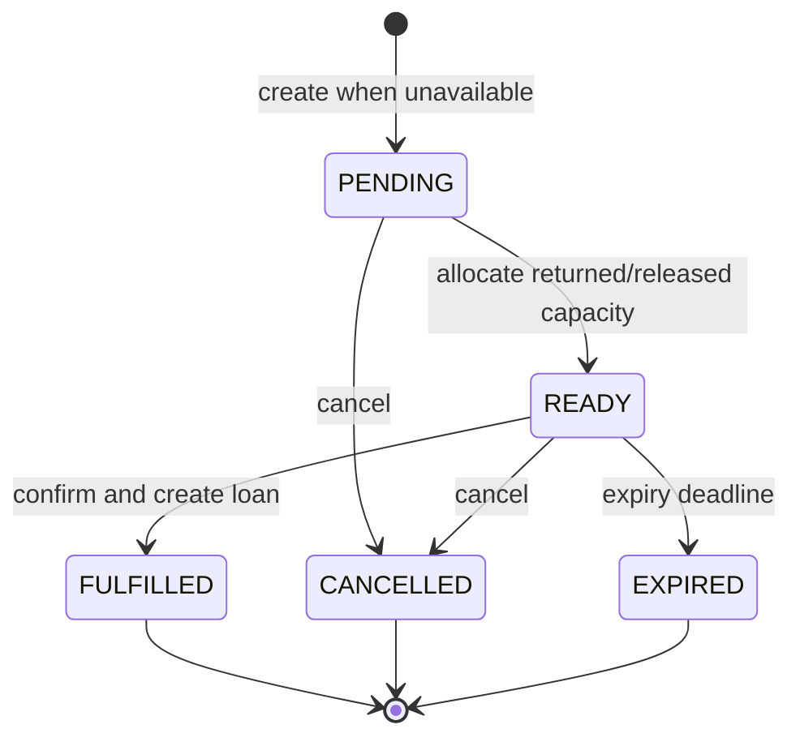

# Developer Guide

## Reservation Lifecycle

Reservations queue users for unavailable book titles. This application currently tracks inventory at title level, not physical-copy level. A `READY` reservation therefore represents a held unit of title capacity.

### States

| State | Meaning | Terminal |
| --- | --- | --- |
| `PENDING` | The user is queued for an unavailable title. | No |
| `READY` | A returned copy is held for this user until `expires_at_timestamp`. | No |
| `FULFILLED` | The user confirmed the hold and received a loan. | Yes |
| `CANCELLED` | The user cancelled the reservation. | Yes |
| `EXPIRED` | The ready hold passed its deadline. | Yes |

### Allowed Transitions



Terminal reservations never transition again. An API must expose explicit actions, not a generic caller-controlled status update.

### Allocation Rules

- Create a reservation only when `available_copies` is zero.
- A user may have at most one active (`PENDING` or `READY`) reservation for a title and may not reserve a title they currently have on loan.
- The pending queue is first-come-first-served by `created_at_timestamp`, then `id`.
- A return promotes the first pending reservation to `READY`, sets its deadline, and creates one in-app notification. If no pending reservation exists, it increments `available_copies`.
- A ready cancellation or expiry promotes the next pending reservation. If no pending reservation remains, it increments `available_copies`.
- Confirmation creates the loan and marks the reservation fulfilled. It does not decrement `available_copies`, because the ready reservation already holds that capacity.

### Inventory Invariant

For every title, preserve this equation inside one transaction:

```text
available_copies + active_loan_count + ready_reservation_count = total_copies
```

Lock the target `Book` row with `SELECT ... FOR UPDATE` before checking or changing availability, queue state, loans, or total copies. Insert a ready notification in the same transaction as its `PENDING -> READY` transition. This prevents two concurrent actions from allocating the same capacity or emitting duplicate notifications.
