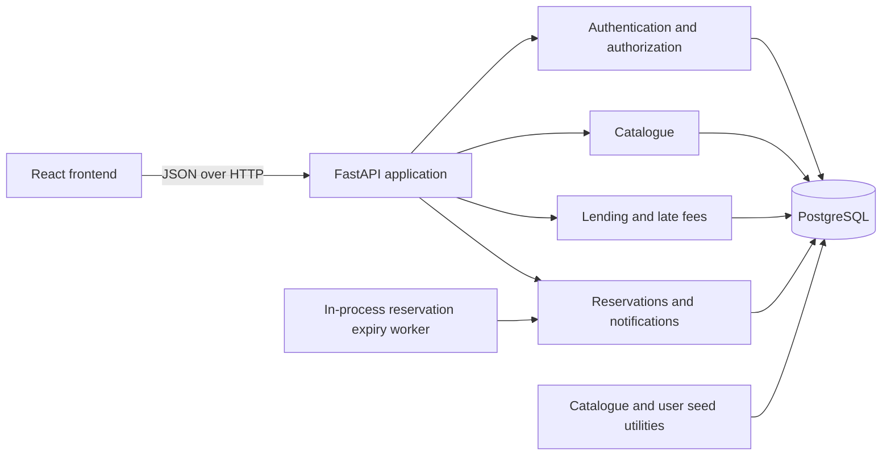
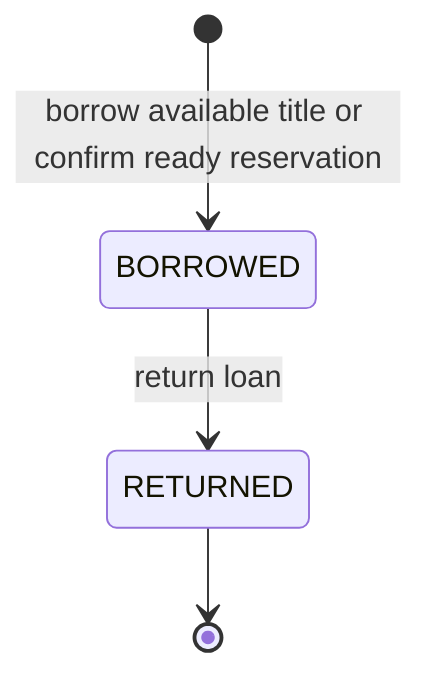
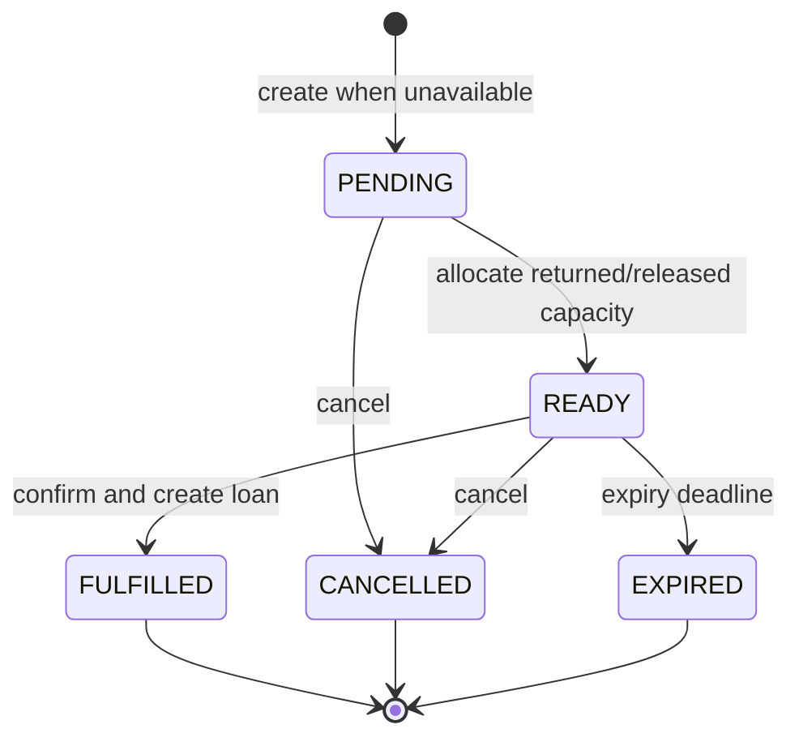

# Developer Guide

This guide documents the domain rules that must remain true when changing loan,
reservation, notification, or inventory behavior. API details are available in
the [OpenAPI specification](openapi.json).

## System Overview



The backend is a single application with router and service modules, not a set
of independently deployed services. PostgreSQL is the source of truth for
users, books, loans, reservations, and notifications. The frontend never owns
or calculates domain state such as availability or late fees.

## Docker Runtime

`docker compose up --build` starts the PostgreSQL database, applies Alembic
migrations, loads the checked-in 100-book catalogue, then starts the FastAPI API
and Nginx-served frontend. Copy the root `.env.example` to `.env` first and set
the database credentials and `JWT_SECRET_KEY`. Compose derives the API
`DATABASE_URL` with its internal `db` hostname.

The `postgres_data` named volume retains database state between starts. Run
`docker compose down --volumes` only when intentionally discarding that state.
The frontend is exposed on `http://localhost:8080` and proxies application API
paths to the backend, so no frontend API-origin environment variable is needed.

## Domain Model

A `Book` represents a title and owns aggregate inventory counts; the system does
not identify individual physical copies. A `BookLoan` assigns one unit of title
capacity to a user, while a `READY` `BookReservation` holds one unit for its
user before a loan is created.

## Loan Lifecycle

### States

| State | Meaning | Terminal |
| --- | --- | --- |
| `BORROWED` | The user has an active loan for one unit of the title. | No |
| `RETURNED` | The loan has ended and its final late fee is frozen. | Yes |

### Allowed Transitions



A user may have at most one `BORROWED` loan for a title. Returning a loan sets
`returned_timestamp`, calculates and persists the final late fee, and makes its
capacity available to the reservation workflow. A returned loan cannot become
active again; renewal is not supported.

### Late-Fee State

The late fee is not a separate lifecycle status. For an active loan, it is the
number of complete 24-hour periods between `due_at_timestamp` and the current
time multiplied by the title's daily rate. Listing a member's loans refreshes
this persisted value. Returning the loan calculates it at `returned_timestamp`;
the resulting value is then immutable.

## Reservation Lifecycle

Reservations let users claim reservation capacity for unavailable book titles.
This application tracks inventory at title level, not physical-copy level. A
`READY` reservation therefore represents a held unit of title capacity.

### States

| State | Meaning | Terminal |
| --- | --- | --- |
| `PENDING` | The reservation is waiting for loaned capacity to be returned. | No |
| `READY` | A returned copy is held for this user until `expires_at_timestamp`. | No |
| `FULFILLED` | The user confirmed the hold and received a loan. | Yes |
| `CANCELLED` | The user cancelled the reservation. | Yes |
| `EXPIRED` | The ready hold passed its deadline. | Yes |

### Allowed Transitions



Terminal reservations never transition again. An API must expose explicit
actions, not a generic caller-controlled status update.

### Allocation Rules

- Create a reservation only when `available_copies` is zero.
- A user may have at most one active (`PENDING` or `READY`) reservation for a
  title and may not reserve a title they currently have on loan.
- Active reservations cannot exceed active loans for the title. A title with
  one loaned copy therefore accepts one active reservation.
- A return promotes an eligible pending reservation to `READY`, sets its
  deadline, and creates one in-app notification. If no pending reservation
  exists, it increments `available_copies`.
- A ready cancellation or expiry promotes another eligible pending reservation.
  If none remains, it increments `available_copies`.
- Confirmation creates the loan and marks the reservation fulfilled. It does
  not decrement `available_copies`, because the ready reservation already holds
  that capacity.

## Cross-Entity Transitions

These operations change more than one domain object and must complete in one
database transaction:

| Action | State transition | Inventory effect | Related effect |
| --- | --- | --- | --- |
| Borrow an available title | New loan enters `BORROWED` | Decrement `available_copies` | Reject if the member already has an active loan for the title. |
| Return without a pending reservation | Loan `BORROWED -> RETURNED` | Increment `available_copies` | Freeze the late fee. |
| Return with a pending reservation | Loan `BORROWED -> RETURNED`; reservation `PENDING -> READY` | No change to `available_copies` | Freeze the late fee and create one ready notification. |
| Confirm a ready reservation | Reservation `READY -> FULFILLED`; new loan enters `BORROWED` | No change to `available_copies` | The ready reservation already holds the capacity. |
| Cancel a pending reservation | Reservation `PENDING -> CANCELLED` | No change | Release the reservation slot. |
| Cancel or expire a ready reservation with another pending reservation | Reservation becomes terminal; pending reservation becomes `READY` | No change to `available_copies` | Create one ready notification for the promoted reservation. |
| Cancel or expire a ready reservation without another pending reservation | Reservation becomes terminal | Increment `available_copies` | Release the held capacity. |

Changing `total_copies` changes `available_copies` by the same delta. It must not
reduce total inventory below capacity already assigned to active loans or ready
reservations. A book with loan history or reservations cannot be deleted.

## Notification Lifecycle

A reservation-ready notification is created as unread during the same
transaction as `PENDING -> READY`. Marking it as read sets `read_at_timestamp`;
notifications are not returned to the unread state. The database permits at
most one ready notification for a reservation, making retries idempotent.

## Inventory Invariant

For every title, preserve this equation inside one transaction:

```text
available_copies + active_loan_count + ready_reservation_count = total_copies
```

Lock the target `Book` row with `SELECT ... FOR UPDATE` before checking or
changing availability, reservation state, loans, or total copies. Insert a ready
notification in the same transaction as its `PENDING -> READY` transition. This
prevents two concurrent actions from allocating the same capacity or emitting
duplicate notifications.

Pending reservations do not appear in the equation because they do not hold
capacity. Terminal loans and reservations remain as history but do not consume
capacity.

## Expiry Processing

Ready reservations are expired both by an in-process periodic worker and during
relevant reservation or inventory mutations. Request-time expiry preserves
correctness if the worker is delayed. The in-process worker is suitable for the
single-process development deployment; a multi-process production deployment
would require a database-backed scheduler or lease so only one worker performs
each expiry pass.
