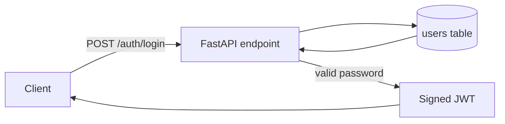

# User Management Login API

## Goal

Add the backend foundation for user authentication: a persisted user entity and a login endpoint that accepts `username` and `password`. A valid login returns a signed access token containing the user's identity and role; invalid credentials never disclose which field failed.

Success means the backend can start against an initialized database, authenticate a pre-provisioned `USER` or `ADMIN` account, and reject invalid credentials safely.

## Current State

- `backend/main.py` contains only a FastAPI application and `GET /health`.
- `backend/pyproject.toml` currently depends only on `fastapi[standard]`; there is no ORM, database configuration, migration tooling, password hashing, JWT support, or test configuration.
- The assignment identifies user management as a domain, but does not prescribe database, token, registration, or account-provisioning behavior.
- This worktree was created clean on branch `user-management`. The source checkout has unrelated untracked files, including the assignment document; do not overwrite or incorporate those changes as part of this feature.

## Decisions

- Use SQLAlchemy 2.x with PostgreSQL as the application database. Require its SQLAlchemy URL from `DATABASE_URL`; configure the PostgreSQL driver explicitly and do not supply an application fallback database.
- Manage schema creation with Alembic rather than creating tables during application startup. The first migration creates `users`.
- Model `users.id` as an auto-incrementing integer primary key, `username` as a non-null unique indexed string, `password_hash` as a non-null string, and `role` as a non-null enum constrained to `USER` or `ADMIN`, defaulting to `USER`.
- Use Argon2id for password hashing, configured with a 64 MiB memory cost, three iterations, and parallelism of four. Store only the encoded Argon2id hash and verify submitted passwords through the hashing library; never log, return, or compare plaintext passwords. Passwords are hashed, not encrypted.
- Expose `POST /auth/login` with the JSON request shape `{ "username": string, "password": string }`. Do not trim or normalize submitted credentials before verification, since doing so can change an existing credential.
- On successful authentication, return `{ "access_token": string, "token_type": "bearer" }`. The signed JWT uses HS256, has a one-hour expiry, and carries `sub` as the user ID plus `role` and `username` claims.
- Load the PostgreSQL connection URL and JWT signing secret from required `DATABASE_URL` and `JWT_SECRET_KEY` environment variables. Startup/configuration must fail clearly if either is missing; no fallback connection string or signing secret will be committed.
- Return HTTP 401 with one generic `Invalid username or password` detail for an unknown username, an incorrect password, or an inactive/malformed credential. Include the `WWW-Authenticate: Bearer` header.
- Registration, password changes/resets, user administration, token refresh/revocation, rate limiting, and protected resource endpoints are out of scope. Accounts are created through a migration-safe seed utility or test fixture, not a public API.

## Diagram

## Implementation Steps

1. Add the database, migration, hashing, JWT, settings, and testing dependencies to `backend/pyproject.toml`; regenerate `uv.lock` with the repository's standard `uv` workflow.
2. Split the backend into small modules for configuration, SQLAlchemy engine/session management, and declarative models. Define a `Role` enum and the `User` model with the exact required columns and database constraints.
3. Configure Alembic against the application metadata and create the initial PostgreSQL migration for `users`, including the role enum constraint. Verify upgrade on an empty PostgreSQL database and downgrade/re-upgrade behavior.
4. Add authentication schemas and an `auth` router. Validate the expected JSON body, look up the user by username, verify `password_hash`, and generate the configured JWT only after a successful verification.
5. Register the router without changing the existing health endpoint. Ensure database sessions are closed per request and configuration errors are surfaced at startup rather than at the first successful login.
6. Add a non-public development/test account-provisioning helper that hashes a supplied password and persists a role-selected user. Make it idempotent by username or fail with an actionable duplicate-user error; do not add a registration route.
7. Add API and persistence tests using an isolated PostgreSQL test database. Cover migration/model constraints, successful `USER` and `ADMIN` logins, unknown users, wrong passwords, malformed request bodies, token claims and expiry, Argon2id hashing, and the absence of plaintext passwords from responses/loggable models.
8. Add `backend/.env.example` with required `DATABASE_URL` and `JWT_SECRET_KEY` keys, ignore the local `backend/.env`, and document the environment-file setup.
9. Update `backend/README.md` with PostgreSQL setup, migrations, configuration, local startup, seed-helper, and login-request instructions. Document that `.env` is local-only and must not be committed.

## Files and Interfaces

- `backend/pyproject.toml`: add runtime and test dependencies.
- `backend/uv.lock`: lock the added dependencies.
- `backend/.env`: local PostgreSQL connection and generated JWT signing secret; ignored by Git.
- `backend/.env.example`: tracked, safe template for required environment variables.
- `backend/.gitignore`: exclude the local `.env` file.
- `backend/main.py`: initialize settings and register the auth router while retaining `GET /health`.
- `backend/app/config.py`: typed `DATABASE_URL` and required `JWT_SECRET_KEY` settings.
- `backend/app/database.py`: SQLAlchemy engine, session factory, and request-scoped session dependency.
- `backend/app/models/user.py`: `Role` and `User` persistence model.
- `backend/app/schemas/auth.py`: login request and token response schemas.
- `backend/app/routers/auth.py`: `POST /auth/login` implementation.
- `backend/app/services/auth.py`: password hashing/verification and JWT creation.
- `backend/alembic.ini`, `backend/alembic/`: migration configuration and initial users migration.
- `backend/scripts/seed_user.py`: controlled account provisioning helper.
- `backend/tests/`: isolated database and endpoint coverage.
- `backend/README.md`: configuration and operational instructions.

## Validation

- Run `uv sync` and the project's test command from `backend/` against an isolated PostgreSQL test database.
- Copy `.env.example` to `.env`, set a non-production PostgreSQL `DATABASE_URL` and a cryptographically random `JWT_SECRET_KEY`, run `alembic upgrade head`, and start `uv run fastapi dev main.py`.
- Provision one `USER` and one `ADMIN` test account through the seed helper.
- Send valid `POST /auth/login` requests for both accounts and decode the returned JWT in a test to confirm `sub`, `username`, `role`, algorithm, and one-hour expiry.
- Confirm unknown usernames and incorrect passwords both return the same 401 response with `WWW-Authenticate: Bearer`.
- Confirm duplicate usernames are rejected by the database and no plaintext password appears in the table or API response.

## Risks and Open Questions

- PostgreSQL must be available for local development, tests, and deployment. The repository currently has no database service definition, so the implementation must document a supported local PostgreSQL setup or add one if the project needs self-contained startup.
- JWT validity duration and revocation policy are product/security decisions. This plan uses a one-hour stateless access token as a minimal baseline; adding logout or immediate revocation requires a token/session store.
- There is no requested account-creation workflow. The seed helper is necessary to exercise login locally, but the ownership and deployment mechanism for real account provisioning need product direction.
- Username case sensitivity is intentionally delegated to the selected database collation. If usernames should be case-insensitive, define and migrate that policy before users are created.

## Handoff Notes

- Keep the public surface limited to `POST /auth/login`; do not add a frontend or registration API in this change.
- Do not hard-code secrets, example passwords, or a production database URL in tracked files. Commit only `.env.example`; keep the generated local `.env` ignored.
- Preserve the existing FastAPI health check and keep the initial data model limited to the four requested user fields.
