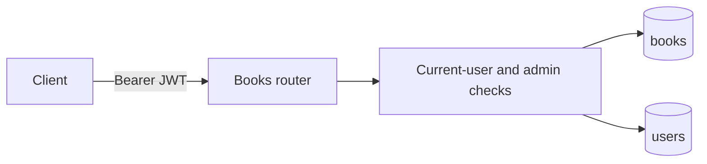

# Admin Book Catalogue API

## Goal

Add a persisted book catalogue resource to the FastAPI backend. Authenticated `ADMIN` users can create a book with its inventory and delete an existing book. Creation returns a complete book representation, and deletion removes the row when no loan, reservation, or notification domain data exists.

Success means a valid admin token can create and delete records in PostgreSQL, while anonymous users and authenticated `USER` accounts cannot use either operation. The scope deliberately excludes loans, reservations, notifications, availability updates after creation, and book metadata updates.

## Current State

- The backend is a FastAPI application backed by PostgreSQL, SQLAlchemy 2.x, and Alembic. Runtime request access uses `AsyncSession` through `app.database.get_db`.
- `users` is the only persisted model. `Role` has `USER` and `ADMIN` values, and successful login tokens contain `sub`, `username`, and `role` claims signed with HS256.
- `POST /auth/login` is the only application API route besides `GET /health`. It does not yet expose a reusable bearer-token authentication or role-authorization dependency.
- The existing test suite uses FastAPI dependency overrides for endpoint tests and an optional isolated PostgreSQL URL for persistence/migration tests.
- `docs/openapi.json` is a checked-in API description that currently describes only the existing routes; it must be regenerated after the router is added.
- The worktree has unrelated untracked root documentation and design files. Preserve them and do not fold them into this feature incidentally.

## Decisions

- Interpret the explicitly stated authorization scope as two endpoints, not a full CRUD surface: `POST /books` and `DELETE /books/{book_id}`. Do not add list, detail, or update endpoints unless product requirements are clarified.
- Add a `books` table with an auto-incrementing integer primary key and non-null columns: `title`, `author`, `date`, `isbn`, `loan_duration_days`, `total_copies`, and `available_copies`.
- Model `date` as PostgreSQL `DATE` and expose it as an ISO 8601 calendar date (`YYYY-MM-DD`) in the JSON API. This plan treats it as a publication date; the product meaning needs confirmation if it instead represents acquisition or another date.
- Treat ISBN as a required, exact, unique string. Preserve submitted hyphens and ISBN-10/ISBN-13 forms rather than normalizing or validating checksums in this scoped change.
- Require non-blank title, author, and ISBN; require `loan_duration_days >= 1` and `total_copies >= 1`. At creation, set `available_copies` server-side equal to `total_copies`; do not accept it in the request body.
- Add database check constraints requiring `available_copies >= 0` and `available_copies <= total_copies`. These remain valid when future loan and reservation workflows decrement availability.
- Reuse bearer JWTs. Introduce a reusable dependency that validates the `Authorization: Bearer <token>` header with the configured secret/HS256 algorithm, requires `sub` and a valid role claim, then queries the current `User` by ID. It returns 401 with `WWW-Authenticate: Bearer` for missing, malformed, expired, invalid, or stale-user tokens.
- Require the current persisted user to have `Role.ADMIN`. Return 403 for a valid authenticated `USER` token. Checking the database role prevents an old token from retaining admin access if its role is later changed.
- `POST /books` returns 201 with the created book. A duplicate ISBN returns 409 with a stable, actionable `ISBN already exists` detail. Other request validation failures use FastAPI's standard 422 response.
- `DELETE /books/{book_id}` returns 204 with no body. Return 404 when the ID does not exist. With loans and reservations out of scope, deletion is a hard delete; future related records must add referential safeguards and likely replace this policy with removal from circulation.
- Do not create a separate service layer for these two simple persistence operations. Keep create/delete in a `books` router, reserving a service only for shared business logic that a later workflow actually needs.

## Diagram

## Implementation Steps

1. Add `Book` to the SQLAlchemy metadata, importing it through the models package so Alembic discovers both user and book tables. Define the requested columns, required constraints, ISBN unique index/constraint, and availability check constraints.
2. Create an Alembic revision that creates `books` without altering `users`. Verify an empty database upgrades to the revision and that downgrade removes only the new table and its indexes/constraints.
3. Add Pydantic request and response schemas. The create schema accepts title, author, date, ISBN, loan duration, and total copies; it validates the required bounds and excludes `id` and `available_copies`. The response schema includes every requested entity field and serializes the database model.
4. Add a reusable async current-user dependency that decodes and validates the existing JWT, loads the user from the request `AsyncSession`, and produces consistent 401 errors. Build an admin-only dependency on it that produces 403 for non-admin users.
5. Add the async `books` router. Its create handler authorizes the admin, constructs `Book` with `available_copies=total_copies`, commits, refreshes, and returns 201. Its delete handler authorizes the admin, loads by ID, returns 404 when absent, otherwise deletes and commits with a 204 response.
6. Translate the database unique-constraint failure for ISBN into the defined 409 response and roll back the failed async session before it can be reused. Do not mask unrelated integrity errors.
7. Register the books router in `main.py`, retaining the existing application lifespan, authentication router, and health endpoint. Regenerate `docs/openapi.json` from the running application or FastAPI schema so the frontend contract includes the new protected endpoints and schemas.
8. Add endpoint tests using dependency overrides for authenticated admin and user identities. Add PostgreSQL-backed model/migration tests for persisted values, automatic IDs, ISBN uniqueness, and availability constraints. Update backend documentation with endpoint examples, bearer authentication requirements, migration instructions, and the publication-date/ISBN assumptions.

## Files and Interfaces

- `backend/app/models/book.py`: `Book` SQLAlchemy model and database constraints.
- `backend/app/models/__init__.py`: ensure `Book` is imported for Alembic metadata discovery.
- `backend/alembic/versions/<revision>_create_books.py`: reversible `books` table migration.
- `backend/app/schemas/book.py`: create request and complete response schemas.
- `backend/app/schemas/__init__.py`: optional package exports if that is the established model-import convention.
- `backend/app/routers/books.py`: admin-protected `POST /books` and `DELETE /books/{book_id}` endpoints.
- `backend/app/routers/dependencies.py` (or the smallest existing shared-auth location): current-user and admin authorization dependencies.
- `backend/main.py`: register the books router.
- `backend/tests/test_books.py`: authorization, validation, creation, conflict, not-found, and deletion coverage.
- `backend/tests/test_database.py`: migration/schema constraint coverage where real PostgreSQL is available.
- `docs/openapi.json`: regenerated API contract.
- `backend/README.md`: operational and API usage documentation.

## Validation

- From `backend/`, run `uv run pytest` with `TEST_DATABASE_URL` pointing to an isolated PostgreSQL database.
- Run `uv run alembic upgrade head`, inspect the `books` table, then exercise downgrade and re-upgrade on a disposable database.
- Login with a seeded `ADMIN` account, create a book using a bearer token, and verify the 201 response has a generated ID and `available_copies == total_copies`.
- Attempt the same request with no token, an invalid/expired token, and a valid `USER` token; confirm 401 for authentication failures, `WWW-Authenticate: Bearer` where applicable, and 403 for the user role.
- Submit blank text fields, invalid date strings, zero/negative durations or counts, and a duplicate ISBN; confirm 422 for request validation and 409 for duplicate ISBN.
- Delete an existing book as an admin, confirm 204 and absence in PostgreSQL, then delete it again and confirm 404.
- Start `uv run fastapi dev main.py`, inspect `/docs` and compare/export `/openapi.json` to the checked-in `docs/openapi.json`.

## Risks and Open Questions

- The request says “CRUD” but explicitly grants only create and delete. This plan intentionally omits read and update endpoints rather than silently expanding scope; confirm whether the catalogue needs `GET` and `PATCH` now.
- The name and meaning of `date` are ambiguous. This plan uses a publication `DATE`; confirm whether it needs a more specific field name or a timestamp/acquisition-date meaning before implementation.
- ISBN uniqueness is applied to the literal submitted string. If the library expects ISBN-10 and ISBN-13 equivalents or hyphen-insensitive duplicates to collide, normalization and a canonical storage policy are required first.
- Hard deletion is safe only while there are no dependent loan/reservation/history records. Future workflow design must define foreign keys and replace hard deletion with a circulation-status policy if history must be retained.

## Handoff Notes

- Keep this backend-only and limited to requested catalogue mutation operations. Do not add frontend work, loans, reservations, notifications, copy-level records, or inventory mutation endpoints.
- Preserve the existing asynchronous request database path and synchronous Alembic/tooling path.
- Do not weaken JWT validation or trust the role claim alone for authorization; load the persisted user and enforce `ADMIN` there.
- Do not modify or remove existing untracked worktree files outside the feature-specific files listed above.
