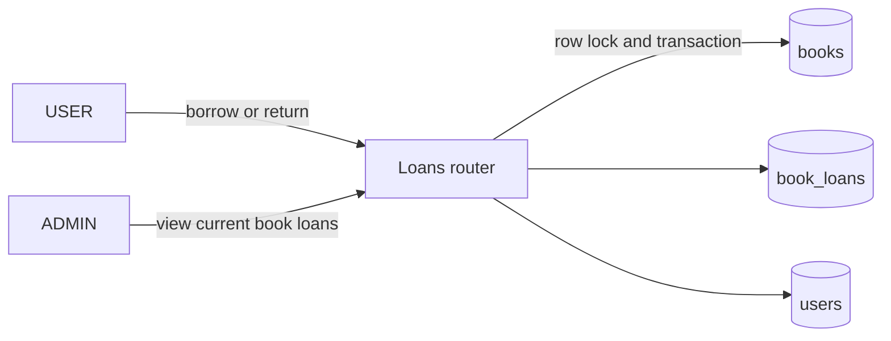

# Book Loans API

## Goal

Add a persisted, concurrency-safe loan workflow to the FastAPI backend. A `USER` can borrow an available book, see only their active loans, and return their own active loan. An `ADMIN` can see the active loans for one book, including borrower IDs. The workflow must keep `books.available_copies` correct under concurrent requests and preserve loan history.

Success means each active loan has stable checkout and due timestamps, a returned loan records its return time, unavailable books cannot be loaned, a user cannot borrow the same title twice concurrently, and role boundaries prevent access outside the stated scope.

## Current State

- The backend uses FastAPI, SQLAlchemy 2.x asynchronous request sessions, PostgreSQL, and Alembic. Migration `20260910_0003` is the current head.
- `Book` represents title-level aggregate inventory through `total_copies` and `available_copies`; there is no individual-copy entity. Loans therefore apply to a book title and decrement/increment the aggregate availability counter.
- `Book.loan_duration_days` is already a positive integer. The existing API represents dates as UTC Unix epoch seconds in integer fields.
- JWT authentication loads the current persisted `User`; `require_admin` already enforces the `ADMIN` role. The backend convention requires dependency objects to be defined at module scope rather than inline in function signatures.
- `DELETE /books/{book_id}` currently hard-deletes a book. Loans need persistent history, so a foreign key from `book_loans` will prevent deletion of a book with any loan.
- The worktree has unrelated untracked root files (`.gitignore`, `LibraryAppHLS.excalidraw`, `docs/product_requirements.md`, and `docs/take_home_assignment.md`). Preserve them.

## Decisions

- Add a `book_loans` table, not a per-copy table. This intentionally follows the existing aggregate-inventory model even though the broader product requirements describe individual physical copies.
- Use columns `id`, `book_id`, `user_id`, `loan_timestamp`, `due_at_timestamp`, `returned_timestamp`, and `status`. All timestamps are non-null `BIGINT` UTC Unix seconds except nullable `returned_timestamp`.
- Define `LoanStatus` as an application-owned `enum.IntEnum`: `BORROWED = 1` and `RETURNED = 2`. Persist it in an `INTEGER` column, with a database check constraint restricting values to `1` and `2`; do not create a PostgreSQL enum type.
- Add foreign keys from `book_loans.book_id` to `books.id` and `book_loans.user_id` to `users.id`, both using the default restrictive behavior. A book that has any current or historical loan cannot be hard-deleted. Do not cascade loan-history deletion.
- Add database check constraints requiring `due_at_timestamp >= loan_timestamp` and a consistent lifecycle: `BORROWED` rows have `returned_timestamp IS NULL`; `RETURNED` rows have `returned_timestamp IS NOT NULL`.
- A loan request locks the target book row using `SELECT ... FOR UPDATE` in one transaction. It rejects a missing book with 404, an unavailable book with 409, and an already-active loan by that user for that book with 409. On success it creates the loan and decrements `available_copies` before committing. This serializes competing loans for the same book and prevents negative availability.
- A user can have at most one active loan for a book title, but may have active loans for different titles. Enforce this both in the service logic and with a partial unique index on `(user_id, book_id) WHERE status = 1`.
- Calculate and persist `due_at_timestamp` as `loan_timestamp + (book.loan_duration_days * 86_400)` at checkout. Later edits to `loan_duration_days` do not change existing loans.
- `POST /loans/{loan_id}/return` is available only to `USER`. It locks and loads the specified loan, returns 404 if it does not exist, returns 403 if it belongs to another user, and returns 409 if it is already returned. In the same transaction it locks the related book, changes the loan to `RETURNED`, stores the current UTC epoch second, and increments `available_copies`.
- An overdue loan stays `BORROWED` and is returned by active-loan APIs until it is returned. Overdue display state can be derived from `due_at_timestamp < now`; no overdue status, fee calculation, reservation, renewal, or notification is added.
- Add a `require_user` authorization dependency that accepts only persisted `Role.USER` accounts and returns 403 for valid `ADMIN` tokens. Reuse `get_current_user` so authentication failures remain 401 with `WWW-Authenticate: Bearer`.
- Expose these protected endpoints:
  - `POST /books/{book_id}/loans` (`USER`, 201): creates the caller's loan; no request body is required.
  - `GET /loans/me` (`USER`, 200): returns the caller's active loans, ordered by `loan_timestamp` descending.
  - `POST /loans/{loan_id}/return` (`USER`, 200): returns the caller's updated loan record.
  - `GET /books/{book_id}/loans` (`ADMIN`, 200): returns active loans for the requested book, ordered by `loan_timestamp` descending, or 404 when the book does not exist.
- Use a single `BookLoanResponse` schema containing the persisted loan fields. The admin response exposes `user_id`; no username or additional user data is returned. The caller's active-loan response contains the same shape, including `book_id`; book metadata joins are deliberately deferred.
- Add the following purpose-built partial indexes for active-loan reads:
  - Unique `(user_id, book_id) WHERE status = 1` enforces the one-active-loan rule and supports exact duplicate checks.
  - `(user_id, loan_timestamp DESC) WHERE status = 1` supports `GET /loans/me`.
  - `(book_id, loan_timestamp DESC) WHERE status = 1` supports `GET /books/{book_id}/loans`.
- Do not add both unrestricted `(user_id, book_id)` and `(book_id, user_id)` indexes. B-tree composite indexes have a leftmost-prefix order: neither ordering efficiently supports the other endpoint's leading-column lookup. The two partial read indexes are required by distinct query patterns, while the partial unique index covers the exact user/book duplicate check.

## Diagram

## Implementation Steps

1. Add `LoanStatus` and the `BookLoan` SQLAlchemy model in `app/models/book_loan.py`. Use typed mapped columns, named foreign keys/check constraints, the partial unique index, and the two partial active-loan listing indexes. Import the model through `app.models` so Alembic metadata discovery includes it.
2. Create a reversible Alembic revision after `20260910_0003` that creates `book_loans` with the exact columns, foreign keys, constraints, and indexes. Its downgrade drops only the new table and its dependent indexes/constraints.
3. Add `BookLoanResponse` in `app/schemas/book_loan.py`, configured for ORM attribute serialization. Its `status` field is `LoanStatus` so JSON exposes the integer mapping. Export it from the schemas package only if that package uses exports.
4. Add `require_user` alongside the existing current-user and admin dependencies. It must preserve the shared authentication behavior and return a stable 403 detail for a valid admin token.
5. Create `app/routers/loans.py` for user-scoped `GET /loans/me` and `POST /loans/{loan_id}/return`. Scope every user-owned lookup to the authenticated user; do not trust a client-supplied user ID.
6. Add `POST /books/{book_id}/loans` and `GET /books/{book_id}/loans` to the existing books router to keep book-scoped routes together. For borrowing, lock the book before checking inventory and duplicate active loan state. For the admin listing, explicitly verify the book exists before querying loans.
7. Implement return as one transaction that locks the loan and its book, validates ownership and active status, updates the lifecycle fields, and restores exactly one available copy. Roll back after integrity errors before producing expected conflict responses; do not mask unrelated failures.
8. Update the book deletion handler's error handling for the new restrictive foreign key. Return a stable 409 explaining that a book with loan history cannot be deleted, and roll back the failed transaction. Retain successful hard deletion only for books with no loan rows.
9. Register the loans router in `main.py`. Regenerate `docs/openapi.json`, update `backend/README.md` with endpoint examples, role requirements, timestamp/status mappings, conflicts, and the no-reservations/no-fees limitation, and add sample requests if the existing samples are maintained as the API collection.
10. Add focused unit/API tests with dependency overrides and PostgreSQL-backed schema tests. Avoid adding frontend work, reservations, per-copy inventory, loan history endpoints, late fees, renewals, or user administration.

## Files and Interfaces

- `backend/app/models/book_loan.py`: `LoanStatus`, `BookLoan`, constraints, foreign keys, and indexes.
- `backend/app/models/__init__.py`: import/export the new model for Alembic discovery.
- `backend/alembic/versions/<revision>_create_book_loans.py`: reversible table/index migration after revision `20260910_0003`.
- `backend/app/schemas/book_loan.py`: response schema for loan resources.
- `backend/app/routers/dependencies.py`: `require_user` dependency and module-level dependency object.
- `backend/app/routers/loans.py`: user active-loan list and return endpoints.
- `backend/app/routers/books.py`: user borrow endpoint, admin book-loan list, and deletion FK-conflict translation.
- `backend/main.py`: register the loans router.
- `backend/tests/test_book_loans.py`: endpoint authorization, lifecycle, ownership, availability, and conflict tests.
- `backend/tests/test_books.py`: update deletion coverage for book rows with persisted loan history.
- `backend/tests/test_database.py`: book-loans table, constraints, foreign keys, partial indexes, and migration coverage.
- `backend/README.md`, `backend/sample_requests/`, and `docs/openapi.json`: operational documentation and generated API contract.

## Validation

- From `backend/`, run `./scripts/test.sh`; repeat with `TEST_DATABASE_URL` set to an isolated migrated PostgreSQL database.
- Run `uv run alembic upgrade head`, inspect `book_loans` and its three partial indexes, then downgrade and re-upgrade a disposable database.
- As a `USER`, borrow a book with one available copy; confirm 201, `BORROWED` status value `1`, UTC epoch timestamps, due date calculated from the current book duration, and `available_copies` decremented once.
- Attempt a second active loan for the same user/title and a loan with zero availability; confirm both return 409 without changing inventory. Exercise two concurrent requests for the final available copy and verify exactly one commits.
- Confirm a `USER` sees only their active loans. Confirm an `ADMIN` receives 403 for each user circulation endpoint, while a `USER` receives 403 for the admin per-book list; unauthenticated callers receive 401 with `WWW-Authenticate: Bearer`.
- As a user, return their active loan and confirm status `2`, non-null return timestamp, and one restored available copy. Verify repeat returns are 409 and another user's loan cannot be returned.
- Confirm a past-due loan remains in active-loan queries without creating a fee or altered status.
- Confirm the admin per-book endpoint lists only active loans with borrower IDs, returns 404 for an absent book, and excludes returned loans.
- Create any loan record, attempt `DELETE /books/{book_id}`, and confirm 409 with no history loss. Confirm a never-loaned book can still be deleted.
- Start the app, inspect `/docs`, and regenerate/compare the checked-in OpenAPI document.

## Risks and Open Questions

- This feature deliberately retains aggregate title-level inventory. It cannot identify which physical copy was loaned, so migrating to the product requirement's per-copy model later requires a separate data-model migration and changing `book_loans` to reference a copy.
- The restrictive foreign key preserves history but means an ISBN/title cannot be deleted after any loan. A future catalogue-removal workflow should use a circulation/removal state rather than delete the book.
- There is no member borrowing limit, inactive-account state, fee balance, or reservation hold rule in the current user model. This plan does not invent any of those policies.
- Clock time is application-server UTC time. If strict cross-service clock consistency becomes important, the system should source timestamps from PostgreSQL or a shared time service.

## Handoff Notes

- Implement the status mapping as application code backed by `INTEGER`; do not introduce a PostgreSQL enum.
- Keep all availability mutation and loan lifecycle changes in the same transaction, with a row lock on the book before mutating its counter.
- Preserve existing asynchronous request-session patterns and module-level FastAPI dependency declarations.
- Do not overwrite unrelated untracked worktree files.
