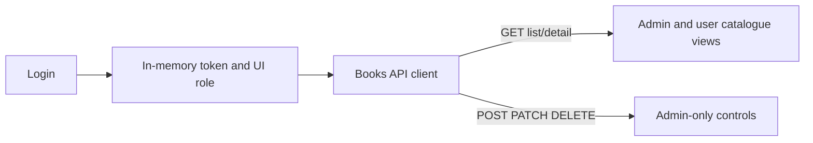

# Frontend Books Catalogue

## Goal

Extend the React frontend from login-only state into a protected Books catalogue. Administrators can list, view, create, edit, and delete books. Normal users can list and view books, including availability, but do not see or receive mutation controls.

This is a frontend-only Books API slice. It deliberately excludes loans, returns, reservations, notifications, copy-level workflows, profile work, and backend/API-contract edits.

## Current State

- `frontend/` is a React 19, TypeScript, Vite application with one login page in `frontend/src/App.tsx` and no router or component library.
- Successful login retains only an in-memory access token. The current app does not decode role claims, make authenticated requests, or render post-login content.
- `frontend/src/api/auth.ts` provides the established native-`fetch` API-client pattern and optional `VITE_API_BASE_URL` configuration.
- `frontend/vite.config.ts` proxies `/auth` only; `/books` would not reach the local backend during development until that proxy rule is added.
- `docs/openapi.json` defines bearer-protected `GET /books`, `GET /books/{book_id}`, `POST /books`, `PATCH /books/{book_id}`, and `DELETE /books/{book_id}` operations. It defines `BookCreate`, partial `BookUpdate`, and `BookResponse`; a successful delete is `204` with no response body.
- The documented `BookResponse.date` is an integer while create/update payloads send `date` as a string. The frontend must display the response value without attempting to reinterpret or change the API contract.
- The current backend implementation applies `require_admin` to both GET endpoints, and its tests assert that a `USER` receives `403`. This conflicts with the requested normal-user read experience. No frontend change can overcome that authorization rule.
- The worktree contains unrelated untracked root documentation and an Excalidraw file. Preserve them.

## Decisions

- Keep the access token in React memory only, matching the existing login plan. Signing out clears the full authenticated session and returns to the login form.
- Decode the JWT payload locally after a successful login solely to select the UI capability (`ADMIN` or `USER`). Do not treat that decoded role as authorization; every Books request continues to send the bearer token and the server remains authoritative. Reject a token without either supported role as an invalid sign-in response.
- Avoid adding a routing package for this two-screen slice. Keep a small view state in `App` for the catalogue list, book detail/form, and sign-out action.
- Add a focused `frontend/src/api/books.ts` module using native `fetch`. It will centralize the `Authorization: Bearer <token>` header, type guards, JSON parsing, API-error normalization, and the five documented Books operations.
- Request the documented paths and shapes exactly: `GET /books`, `GET /books/{id}`, `POST /books`, `PATCH /books/{id}`, and `DELETE /books/{id}`. `PATCH` sends only changed fields; create sends all six required `BookCreate` fields.
- Treat `date` as an opaque API field in TypeScript: form input is a required string, while the response preserves the contract's integer type. Present the returned value as supplied rather than inventing a date conversion policy while the contract is inconsistent.
- Render the same browse and detail information for both roles: title, author, ISBN, date, loan duration, total copies, and available copies. Display a clear availability label derived only from `available_copies > 0`; do not add loan or reservation actions.
- Render Add, Edit, and Delete controls only for `ADMIN`. A `USER` has no client navigation to mutation forms. Handle `401` by signing out with a session-expired message and `403` as an access error; this keeps the UI safe if a stale or altered token is used.
- Require confirmation before deletion. Disable the affected action while any create, update, or delete request is pending. On mutation success, refresh the list from the API rather than maintaining optimistic inventory state.
- Perform browser validation for required text values and numeric bounds (`loan_duration_days >= 1`, `total_copies >= 0`), while preserving backend `422` feedback as the authoritative validation result. Show duplicate ISBN (`409`), missing book (`404`), unauthorized (`401`/`403`), network, and unexpected-response messages without exposing token data.
- Plan against a prerequisite backend authorization adjustment: authenticated `USER` accounts must be allowed to call the two GET operations while mutations remain admin-only. This plan does not implement that adjustment because scope is frontend-only.

## Diagram

## Implementation Steps

1. Extend the successful login result consumed by `App` into an in-memory session containing the token and locally decoded role claim. Retain the existing credential-validation, error-focus, and sign-out behavior; ensure the token and JWT payload are never rendered or logged.
2. Update `frontend/vite.config.ts` so the development proxy sends both `/auth` and `/books` to `http://127.0.0.1:8000`. Preserve `VITE_API_BASE_URL` behavior for deployments with a configured API origin.
3. Create `frontend/src/api/books.ts` with `Book`, `BookCreate`, and `BookUpdate` contract types; a typed bearer-aware request helper; and `listBooks`, `getBook`, `createBook`, `updateBook`, and `deleteBook` functions. Guard JSON parsing for absent/non-JSON bodies, including the successful `204` response.
4. Replace the signed-in confirmation with a protected catalogue shell. Fetch `GET /books` after login, show loading, empty, retryable-error, and successful-list states, and offer a semantic list/table layout that works at narrow and wide viewports.
5. Add a book-detail view loaded with `GET /books/{book_id}`. It displays all `BookResponse` fields, supports returning to the catalogue, and handles a book removed between list and detail loads as a `404` state.
6. For administrators, add an Add Book action and a reusable create/edit form. Use labelled inputs for title, author, date, ISBN, loan duration, and total copies; seed edit fields from the selected book; submit `POST` for creation and sparse `PATCH` for changes; and return to/refetch the relevant catalogue state after success.
7. For administrators, add an explicit delete action on the detail view with an accessible confirmation step. On `204`, return to the refreshed list. Preserve the current view and show actionable error feedback when deletion fails.
8. For normal users, render only browse and detail actions. Do not mount mutation buttons, forms, or delete confirmation controls for `USER` sessions.
9. Refactor `App.css` and, if needed, `index.css` from the narrow login panel into the existing visual language for a responsive application shell, catalogue list, detail metadata, availability status, forms, and action feedback. Preserve visible keyboard focus, `aria-live` request feedback, disabled pending controls, and reduced-motion handling.
10. Add API-client and UI tests with Vitest and React Testing Library. Mock `fetch` and the login module; do not require a live backend for frontend unit tests.
11. Update the root README's frontend section with the new Books API proxy dependency, role-based capabilities, and the backend prerequisite for member read access. Keep loan and reservation features explicitly out of scope.

## Files and Interfaces

- `frontend/src/App.tsx`: in-memory authenticated session and role-specific catalogue, detail, and admin CRUD UI state.
- `frontend/src/App.css`: responsive, accessible Books catalogue and form styling consistent with the existing login presentation.
- `frontend/src/api/auth.ts`: only the smallest change needed if the login/session boundary needs a typed role-decoding helper.
- `frontend/src/api/books.ts`: Books API models, authenticated HTTP operations, response guards, and normalized failures.
- `frontend/src/api/books.test.ts`: contract request construction and status/error handling tests.
- `frontend/src/App.test.tsx`: login-to-catalogue, admin CRUD controls, user read-only controls, loading/error, and mutation feedback tests.
- `frontend/vite.config.ts`: local `/books` proxy alongside `/auth`.
- `README.md`: frontend catalogue startup, role behavior, and backend read-authorization prerequisite.

## Validation

- From `frontend/`, run `npm run lint`, `npm run test`, and `npm run build`.
- With an admin account, sign in and confirm `GET /books` includes the bearer token, renders loading/empty/list states, opens a detail, creates a valid book, updates one field through `PATCH`, confirms deletion, and removes the book after the `204` response.
- Verify create blocks blank required text, zero/negative loan duration, and negative copies before requesting; verify `422`, `409`, `404`, `401`, `403`, network, and non-JSON failures produce usable feedback without crashing.
- With a user account, once the backend GET authorization prerequisite is delivered, confirm list and detail requests succeed and mutation controls are absent. Confirm direct mutation attempts receive a handled `403` if the API is called outside the UI.
- In the current backend state, verify the user catalogue displays the handled access error rather than claiming read access works. Record this as expected until the backend prerequisite is implemented.
- Test keyboard navigation, error announcement, pending-action disabling, and desktop plus narrow mobile layouts. Confirm neither the bearer token nor decoded claims appear in the DOM.

## Risks and Open Questions

- **Blocking integration dependency:** the current backend returns `403` for `USER` requests to both Book read endpoints. A backend change is required before the requested normal-user read flow is functional; this plan does not include or authorize that work.
- The OpenAPI contract does not expose a user identity/role endpoint. Local JWT payload decoding is the minimal way to choose UI capabilities, but it is only an affordance and must never replace server authorization. A future `/me` endpoint would provide a stronger frontend session contract.
- `BookResponse.date` is an integer while book writes use a string, and backend tests currently demonstrate an epoch-style integer. Product/API owners need to resolve the semantic and serialized date format before adding user-friendly formatting.
- The API contract documents bearer security but not its role matrix or explicit `401`, `403`, `404`, and `409` responses for Books operations. The frontend will defensively handle these observed statuses; the contract should be expanded in a separately scoped backend/API-doc task.

## Handoff Notes

- Implement frontend files only. Do not modify backend routes, authorization dependencies, OpenAPI output, database models, migrations, or tests.
- Do not add loaning, returns, reservations, notifications, copy management, search/filter APIs, token persistence, token refresh, or a router library in this slice.
- Preserve all unrelated untracked worktree files. The prompt history entry was added at `/home/ish1506/library_app_prompts.txt` as required by repository instructions.
