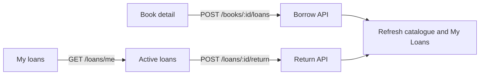

# Frontend Loaning A Book

## Goal

Extend the protected React catalogue with the member circulation flow supported by the existing API. A signed-in `USER` can borrow an available book, see their active loans, understand each due date and overdue state, and return an active loan they own. The UI must keep inventory and loan state consistent after every successful or conflicting request.

Success means a member can move from catalogue discovery to borrowing without entering a book or user ID, receives clear feedback for unavailable or already-loaned books, can identify the borrowed title and due date, and can return it from the active-loans view. This is frontend-only and assumes the checked-in backend loan API is available.

## Current State

- `frontend/` is a React 19, TypeScript, Vite application with native `fetch`, Vitest, and React Testing Library. The main screen and catalogue state are implemented in `frontend/src/App.tsx`.
- `frontend/src/api/books.ts` models `Book.available_copies`, but has no loan operations. `App.tsx` currently displays availability and admin CRUD controls, but no borrow, active-loan, or return UI.
- `frontend/vite.config.ts` proxies `/auth` and `/books` to `http://127.0.0.1:8000`; `/loans` must be added for local development.
- The backend exposes authenticated `USER` operations: `POST /books/{book_id}/loans` with no body, `GET /loans/me`, and `POST /loans/{loan_id}/return`. Valid `ADMIN` tokens receive `403` for these user circulation routes.
- `BookLoanResponse` contains numeric `id`, `book_id`, `user_id`, `loan_timestamp`, `due_at_timestamp`, nullable `returned_timestamp`, and numeric `status`. `LoanStatus.BORROWED` is `1` and `RETURNED` is `2`; `/loans/me` returns active borrowed loans only.
- The backend intentionally uses Unix epoch seconds, aggregate title-level `available_copies`, and no reservations, fees, renewals, or copy-level identity.
- The frontend keeps the bearer token in React memory and derives the UI role from the JWT. Preserve that session model and current catalogue/admin behavior.

## Decisions

- Scope this slice to the `USER` circulation journey: borrow from a book detail view, view active loans in a dedicated section, and return from that section. Do not add admin loan-history screens; the backend admin per-book endpoint remains available for a later plan.
- Add `frontend/src/api/loans.ts` with `BookLoan`, status constants/type guards, `borrowBook`, `listMyLoans`, and `returnLoan`. Use the established bearer-aware native `fetch` pattern and normalize `401`, `403`, `404`, `409`, network, and malformed-response failures.
- Borrowing is available only when the selected book reports `available_copies > 0` and the session role is `USER`. Never render borrow controls for `ADMIN`; server authorization remains authoritative.
- Use the book detail screen as the checkout confirmation surface. The action identifies the title, disables while pending, and shows a success status containing the due date after a `201` response.
- Add a “My loans” view or section reachable from the authenticated shell. Since loan responses contain only `book_id`, resolve titles and author metadata from the existing catalogue state; if a referenced book is absent, show a safe fallback using the book ID rather than making an unbounded request per loan.
- Convert Unix seconds to one local calendar/date-time display through a small formatter. Derive overdue presentation from `status === BORROWED` and `due_at_timestamp < current time`; do not invent a new API status or mutate overdue records locally.
- On borrow success, refresh the selected book/list data and `GET /loans/me`. On return success, refresh both the active-loan list and catalogue so availability is restored. Do not optimistically change copies.
- On borrow `409`, retain the detail view, explain that the book is unavailable or already on loan, and refresh book/list state so stale availability cannot leave a misleading enabled button. Handle `404` for a removed book, `401` with the existing sign-out behavior, and `403` as an access error without retrying.
- Prevent duplicate borrow/return submissions with per-action pending state. Keep errors local to the affected view where possible, use existing status/alert accessibility patterns, and never render tokens or user IDs as member-facing data.
- Keep token persistence, router-library adoption, reservations, late fees, renewals, notifications, and backend/API changes out of scope.

## Diagram

## Implementation Steps

1. Add the `/loans` Vite development proxy and preserve the configured `VITE_API_BASE_URL` behavior used by the existing API clients.
2. Create `frontend/src/api/loans.ts` with contract types, `LoanStatus` values, response guards, authenticated request handling, and the three documented user operations. Include tests for request paths/methods, empty request bodies, response validation, and normalized status errors.
3. Add authenticated loan state to `App.tsx`: active loans, loan loading/error state, and independent borrow/return pending state. Load `GET /loans/me` after a `USER` signs in and whenever the user opens or retries the My Loans view.
4. Add a My Loans navigation action and accessible view. Render title/author from catalogue data, loan and due dates, an overdue indicator derived from the current clock, and a Return button only for active member loans. Render useful loading, empty, retry, and malformed-response states.
5. Add a `Borrow book` action to the selected book detail for `USER` sessions only. Disable it when unavailable or pending, show the current availability, submit without a body, and display the returned due date on success.
6. Centralize post-mutation refresh behavior so borrow and return cannot leave stale catalogue or loan data. Re-fetch rather than manually editing `available_copies`; preserve the current detail or My Loans view when a refresh fails and show a retryable error.
7. Map API errors to actionable UI feedback: expired session, forbidden circulation role, missing book/loan, unavailable book, duplicate active loan, network failure, and unexpected response. Ensure a borrow conflict triggers a fresh availability check.
8. Extend `App.test.tsx` with USER borrow success, unavailable-button behavior, borrow conflict refresh, My Loans rendering, overdue display, return success, return failure, loading/empty/error states, and ADMIN absence of member circulation controls. Keep existing catalogue and login tests passing.
9. Update `frontend/src/api/books.test.ts` only if shared API behavior is extracted; otherwise add `frontend/src/api/loans.test.ts`. Update `README.md` with the member loan flow, `/loans` proxy, and explicit limitations.

## Files and Interfaces

- `frontend/src/api/loans.ts`: `BookLoan`, loan status mapping, authenticated borrow/list/return operations, response validation, and error normalization.
- `frontend/src/api/loans.test.ts`: fetch contract and status/error tests for the loan client.
- `frontend/src/App.tsx`: member loan state, My Loans view, borrow action, return action, refresh coordination, and role gating.
- `frontend/src/App.test.tsx`: member circulation behavior and regression coverage for existing catalogue roles.
- `frontend/src/App.css`: responsive styling for loan summary cards, due/overdue states, action feedback, and pending controls.
- `frontend/vite.config.ts`: local `/loans` proxy.
- `README.md`: frontend loan behavior, startup notes, and out-of-scope limitations.

## Validation

- From `frontend/`, run `npm run lint`, `npm run test`, and `npm run build`.
- With a seeded `USER`, sign in, open an available book, borrow it, confirm the request has the bearer token and no body, and verify the detail/list availability and My Loans entry refresh.
- Confirm a second borrow of the same title displays the handled `409` conflict and refreshes availability without creating duplicate UI state.
- Confirm a zero-availability book has no enabled borrow action and a backend conflict remains handled if availability becomes stale.
- Confirm My Loans shows title fallback behavior, due dates, overdue state, loading, empty, retry, malformed response, network, `401`, `403`, `404`, and `409` feedback.
- Return an active loan and verify the loan disappears, the book's available copies refresh, and repeat/foreign-loan attempts are handled without crashing.
- With an `ADMIN`, confirm borrow, My Loans, and return controls are absent while existing admin catalogue CRUD remains available.
- Check keyboard focus, status/error announcements, disabled pending actions, narrow mobile layout, and that bearer tokens and internal user IDs are not rendered.

## Risks and Open Questions

- The loan response does not include book title/author, so the My Loans view depends on the current catalogue list. The plan uses a book-ID fallback rather than adding per-loan book requests; a future API could return embedded book metadata.
- `due_at_timestamp` is server epoch time and overdue status depends on the browser clock. The UI should label dates consistently but must not change loan status locally.
- The current frontend has a monolithic `App.tsx`; this plan keeps the change small and follows that structure instead of introducing a router or component framework. Extract only a shared API helper if duplication becomes material.
- Backend authorization and loan transaction behavior are prerequisites. This plan does not alter routes, schemas, migrations, database state, or backend tests.

## Handoff Notes

- Implement frontend files only; preserve the existing login, in-memory session, catalogue, and admin CRUD behavior.
- Use the exact API paths and numeric status values from `docs/openapi.json` and the backend loan design.
- Do not add reservations, notification subscriptions, late-fee calculations, renewal controls, loan history, admin loan dashboards, or copy-level selection.
- The prompt was logged at `/home/ish1506/library_app_prompts.txt` with the `fe-book-loans` branch prefix.
