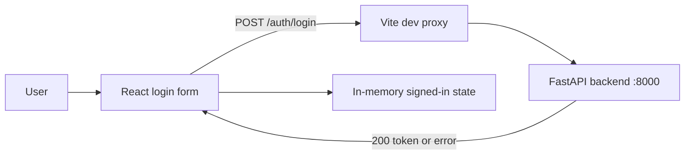

# Frontend Login

## Goal

Create a small React, TypeScript, and Vite frontend that lets a seeded library user submit credentials to the existing login API and receive clear success or failure feedback. The login interaction must be usable on desktop and mobile, prevent duplicate submissions, and avoid exposing the password or bearer token in the UI.

Success means a developer can start the backend and frontend locally, sign in with a provisioned account, observe a signed-in state, and see actionable feedback for invalid or malformed input.

## Current State

- `frontend/` exists but is empty; there is no Node project, frontend build tooling, or UI implementation.
- `docs/openapi.json` defines `POST /auth/login`, accepting required JSON fields `username` and `password`, returning `200` with `access_token` and optional `token_type`, and documenting `422` validation errors.
- The implemented backend at `backend/app/routers/auth.py` also returns `401` with `{"detail":"Invalid username or password"}` for invalid credentials. This response is not currently represented in the OpenAPI document.
- The backend runs at `http://127.0.0.1:8000` by default and has no CORS middleware. A development proxy is therefore required if the Vite dev server is used on its default origin.
- Accounts are provisioned through `backend/scripts/seed_user.py`; there is no registration API or authenticated API route to navigate to after login.

## Decisions

- Scaffold the application in `frontend/` with Vite's `react-ts` template. Use npm and commit `package-lock.json` so installs are reproducible.
- Use native `fetch` and a small typed `login` API module. Do not add a data-fetching library for this single mutation.
- Send the exact request shape defined by the contract: `POST /auth/login` with `Content-Type: application/json` and `{ "username": string, "password": string }`.
- Request the relative `/auth/login` path by default. Configure Vite to proxy `/auth` to `http://127.0.0.1:8000` in development, which avoids a browser CORS request. Production deployment must serve the frontend and API from one origin or set `VITE_API_BASE_URL` to an API origin that permits the frontend origin.
- Define `VITE_API_BASE_URL` in `frontend/.env.example` as optional and use it only as a public client-side API origin. Do not put secrets in a `VITE_` variable, since Vite bundles such values into client code.
- Keep the access token only in React state for this login-only slice. Do not persist it to localStorage, sessionStorage, cookies, logs, or the DOM until protected routes and an agreed session lifecycle exist.
- Validate empty username and password in the browser before submitting. Preserve submitted username after any failure, clear the password after a failed request, and focus the error summary when an error appears.
- Treat `401` as invalid credentials and render the backend's generic message. Translate `422` validation details to a generic request-validation message, and provide a distinct message for network failures and unexpected HTTP responses.
- On a successful response with a non-empty `access_token`, render a simple signed-in confirmation and a `Sign out` action that clears in-memory authentication state. Do not decode, display, or use the token yet.
- Use semantic form controls, associated labels, browser password autofill (`autocomplete="username"` and `autocomplete="current-password"`), visible focus styles, and an `aria-live` status/error region. Keep styling in the app's CSS with no component framework.

## Diagram

## Implementation Steps

1. Run Vite's React TypeScript scaffold command in the empty `frontend/` directory. Remove the template counter/demo content and retain the standard TypeScript, ESLint, and Vite configuration needed by the application.
2. Add a Vite dev-server proxy for `/auth` targeting `http://127.0.0.1:8000`. Add `frontend/.env.example` documenting the optional `VITE_API_BASE_URL` override and ignore local `frontend/.env` files.
3. Define TypeScript request, successful response, FastAPI validation-error, and API-error types in a focused API module. Implement `login(credentials)` with `fetch`, JSON serialization, response parsing guarded for absent/non-JSON bodies, and normalized error results for `401`, `422`, network errors, and unexpected statuses.
4. Replace the template app with a login screen containing a concise Library heading, username and password fields, inline client-validation messages, a submit button, and a progress indicator while the request is pending.
5. Manage form values, validation, pending state, API error state, and in-memory token state in the login app. Disable the form while pending, avoid duplicate requests, reset only the password on an unsuccessful request, and expose the signed-in confirmation only after a valid token response.
6. Add responsive CSS for a centered, readable login panel that remains usable on narrow viewports. Include keyboard-visible focus treatment and respect the user's reduced-motion preference for any feedback transition.
7. Add component and API-module tests with Vitest and React Testing Library. Mock `fetch` rather than requiring the FastAPI server for unit tests.
8. Update the root `README.md` with Node prerequisites, frontend install/start/build/test commands, the backend startup dependency, the local proxy behavior, and how to use a seeded account. Keep backend setup details in `backend/README.md` rather than duplicating them.

## Files and Interfaces

- `frontend/package.json`: React/Vite scripts and frontend test dependencies.
- `frontend/package-lock.json`: locked npm dependency graph.
- `frontend/index.html`: Vite application document title and mount point.
- `frontend/vite.config.ts`: React plugin and development `/auth` proxy.
- `frontend/tsconfig*.json`: Vite React TypeScript compiler settings from the template.
- `frontend/.env.example`: optional public `VITE_API_BASE_URL` configuration.
- `frontend/.gitignore`: exclude local environment files and generated artifacts.
- `frontend/src/main.tsx`: React application bootstrap.
- `frontend/src/App.tsx`: login form and signed-in state UI.
- `frontend/src/api/auth.ts`: typed `POST /auth/login` request and response/error handling.
- `frontend/src/App.css` and `frontend/src/index.css`: responsive, accessible visual styling.
- `frontend/src/**/*.test.tsx`: login interaction and request-result tests.
- `README.md`: top-level frontend development and verification instructions.

## Validation

- From `frontend/`, run `npm install`, `npm run lint`, `npm run test`, and `npm run build` successfully.
- Start the backend according to `backend/README.md`, including migrations and a seeded account, then run `npm run dev` from `frontend/`.
- Log in with valid seeded `USER` and `ADMIN` accounts. Confirm each produces the signed-in confirmation and the page never renders the returned access token.
- Submit the form with each required field empty and confirm no request is sent and the relevant field error is announced.
- Submit an unknown username and a wrong password. Confirm both show the same generic invalid-credentials message, clear only the password field, and leave the username intact.
- Simulate or test a `422` response, an unreachable backend, and an unexpected non-JSON error response; each must present an actionable, non-sensitive error without crashing the page.
- Verify the browser network request targets the Vite origin at `/auth/login` during local development and succeeds through the proxy without a CORS error.
- Check the login form by keyboard only and at a narrow mobile viewport; labels, focus indication, submit behavior, and status messages must remain usable.

## Risks and Open Questions

- The OpenAPI contract omits the backend's `401` login failure response. Update the contract to include it so generated clients and future frontend work are accurate; the implementation should still handle it now.
- No post-login endpoint or route exists, so the successful state cannot yet show user-specific data or demonstrate `Authorization: Bearer` usage. Protected routes should define token expiry and session persistence requirements before this temporary in-memory state is extended.
- A separately hosted production frontend requires backend CORS configuration or a reverse proxy. This frontend-only work intentionally does not modify backend middleware.
- This plan assumes npm is the frontend package manager because the repository has no existing JavaScript package-manager convention.

## Handoff Notes

- Implement only the frontend login slice and its root documentation; do not add registration, profile management, routing, token refresh, or backend changes.
- Retain the API base URL as configuration rather than hard-coding a production hostname.
- The API contract is authoritative for request and success shapes. Keep the explicit `401` handling until the backend OpenAPI output is corrected.
