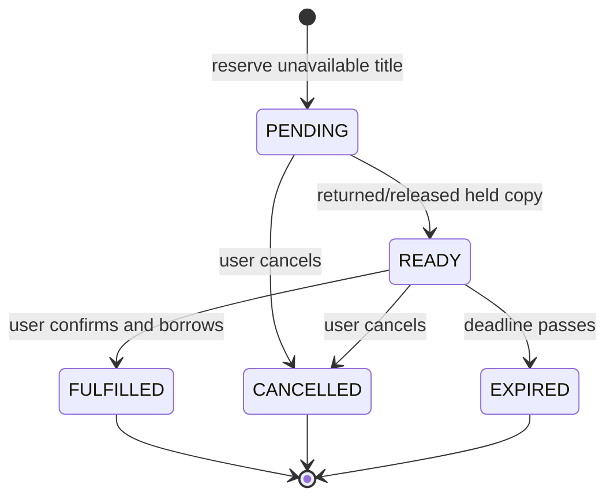

# Book Reservations and In-App Notifications

## Goal

Add a complete, concurrency-safe reservation workflow for unavailable book titles. A `USER` can reserve a title only when no copy is immediately loanable, receives an in-app notification when a returned copy is held for them, and can confirm or cancel the hold. A configurable one-day hold expires automatically and is reassigned to the next reservation or released for normal borrowing.

Success means a ready reservation cannot be bypassed by an ordinary borrower, reservations are served first-come-first-served, a user cannot create duplicate active reservations for the same title, and aggregate inventory remains consistent under concurrent borrow, return, reservation, cancellation, confirmation, and expiry requests.

## Current State

- The backend uses FastAPI, asynchronous SQLAlchemy request sessions, PostgreSQL, and Alembic. Migration `20260910_0006` is the current head.
- `Book` is title-level aggregate inventory: `available_copies` is mutated under a `SELECT ... FOR UPDATE` lock in `backend/app/routers/books.py` and `backend/app/routers/loans.py`. There is no individual-copy model.
- An active `BookLoan` uses `LoanStatus.BORROWED = 1`; the existing partial unique index prevents a user from holding two simultaneous loans for one title.
- The existing frontend is a single React application. `App.tsx` already loads the user's loans after login and displays book availability and loan actions. API clients use typed response guards and tests mock those API modules.
- `Settings` currently reads `DATABASE_URL` and `JWT_SECRET_KEY` through Pydantic settings. Application shutdown already disposes the async engine through FastAPI lifespan.
- The working tree has unrelated untracked files, including `.gitignore`, `LibraryAppHLS.excalidraw`, `bugs.md`, `docs/product_requirements.md`, `docs/take_home_assignment.md`, and an existing open-library seed plan. Preserve them.

## Decisions

- Retain aggregate title-level inventory. A reservation represents a place in a title queue, not a specific physical copy. Individual copy tracking is explicitly out of scope.
- Add `ReservationStatus` as an `enum.IntEnum`, persisted as an `INTEGER` with a named check constraint: `PENDING = 1`, `READY = 2`, `FULFILLED = 3`, `CANCELLED = 4`, `EXPIRED = 5`. Do not introduce PostgreSQL enum types.
- Add `BookReservation` columns: `id`, `book_id`, `user_id`, `created_at_timestamp`, `ready_at_timestamp`, `expires_at_timestamp`, `fulfilled_at_timestamp`, `cancelled_at_timestamp`, and `status`. `created_at_timestamp` is always set; lifecycle timestamps are nullable until their respective transition. All timestamps are UTC Unix epoch seconds in `BIGINT` columns.
- A reservation may be created only if `Book.available_copies == 0`, the requester has no active loan for the same title, and the requester has no `PENDING` or `READY` reservation for that title. Return `409` for each business conflict.
- To implement the requested KISS capacity rule, at reservation creation the total active reservations (`PENDING` plus `READY`) must be below the number of active loans for the title. This permits at most one active reservation for every then-loaned copy. The check and insert occur while the book row is locked.
- A `READY` reservation holds capacity. The inventory invariant is `available_copies + active_loan_count + ready_reservation_count = total_copies`. Consequently, a return that promotes a pending reservation to ready does not increment `available_copies`; normal borrowing cannot take that held copy.
- When a ready reservation is fulfilled, create the new loan without decrementing `available_copies`, because the ready reservation already consumed the available capacity. The user must still not have an active loan for that title.
- When a ready reservation is cancelled or expires, promote the oldest pending reservation in the same transaction. If no pending reservation remains, increment `available_copies` once. A pending cancellation has no inventory effect.
- Queue order is ascending `created_at_timestamp`, then ascending `id` for deterministic ties. The application creates one notification each time a reservation enters `READY`.
- Add a generic `Notification` table with `id`, `user_id`, nullable `reservation_id`, `created_at_timestamp`, nullable `read_at_timestamp`, `type`, and `payload`. Initially `type` has only `RESERVATION_READY`; `payload` contains immutable display data such as title, author, and deadline. A real nullable reservation foreign key, rather than JSON-only linkage, makes notification actions traceable.
- Store a configurable `reservation_hold_seconds` setting from `RESERVATION_HOLD_SECONDS`, default `86_400`. Validate it as a positive integer. Existing reservations retain their persisted expiry timestamp if this setting later changes.
- Run a small in-process expiry task from FastAPI lifespan at a configurable short interval. It finds expired ready reservations, locks each affected book, and applies the same release-or-promote service logic. Each reservation mutation also checks and processes relevant expired holds before deciding availability, so correctness does not depend solely on the worker. The worker is sufficient for this single-process assignment; multi-instance deployment requires a database-backed scheduler/lease.
- Use explicit action endpoints rather than a generic status patch. The server owns legal transitions and all authorization checks.
- Keep notifications as polling for this scope. The frontend polls unread notifications every 10 seconds while a `USER` is signed in, stops on sign-out/unmount, and refreshes reservations after a successful action. Do not add WebSockets, email, push delivery, queue-position estimates, or an admin reservation queue UI.
- Book inventory administration must account for ready holds. Reducing `total_copies` below `active_loan_count + ready_reservation_count` is invalid; increasing or decreasing the total changes `available_copies` by the same delta only after that minimum is satisfied.

## Diagram

## Implementation Steps

1. Add `ReservationStatus` and `BookReservation` in `backend/app/models/book_reservation.py`. Add named foreign keys to `books` and `users`, valid-status and lifecycle-consistency check constraints, and indexes: partial unique `(user_id, book_id)` for `PENDING`/`READY`; partial pending queue `(book_id, created_at_timestamp, id)`; partial ready expiry `(expires_at_timestamp)`; and a book/status index for active-capacity checks. Import the model through `app.models` for Alembic metadata discovery.
2. Add `NotificationType` and `Notification` in `backend/app/models/notification.py`. Restrict the initial integer type value with a named check constraint. Add restrictive foreign keys to users and nullable reservations, an index for `(user_id, read_at_timestamp, created_at_timestamp DESC)`, and a unique partial index for a reservation-ready notification so retries cannot duplicate alerts.
3. Create one Alembic revision after `20260910_0006` that creates both tables, constraints, and indexes. The downgrade must remove only the new tables and their dependent objects.
4. Add reservation and notification Pydantic schemas. Responses expose timestamps, status/type values, book IDs, and notification payloads. Request schemas are not needed for creation/confirmation/cancellation because the book and reservation are path resources.
5. Add a small reservation service module responsible for locking/querying the title queue and applying transitions. Centralize: expiring ready holds, promoting the next pending reservation, emitting a notification, releasing a hold, and creating the fulfilled loan. Every public circulation mutation must use this service rather than duplicate its state logic.
6. Add `POST /books/{book_id}/reservations` to the books router for users. Lock the book, process expired ready holds for it, validate that the title is unavailable and eligible, enforce the active-reservation capacity rule, insert `PENDING`, and commit.
7. Add a reservations router with `GET /reservations/me`, `POST /reservations/{reservation_id}/confirm`, and `DELETE /reservations/{reservation_id}`. Scope all reservation lookups to the current user. Confirm locks the book and reservation, rejects an expired/non-ready/terminal reservation with `409`, creates the loan, and marks the reservation fulfilled atomically. Cancellation is idempotency-safe only in the sense that terminal reservations return `409`; it must never reallocate capacity twice.
8. Modify return handling to lock the book as it does today, mark the loan returned, then promote the queue or increment available inventory in the same transaction. Modify ordinary borrowing to process expired holds for the target book before checking availability. Update book total-copy validation to include ready holds.
9. Add a notifications router with `GET /notifications?unread_only=true` and `PATCH /notifications/{notification_id}/read`. Scope both endpoints to the caller. Listing returns newest first and should use a bounded page size plus a cursor or limit parameter; do not return an unbounded lifetime notification history.
10. Extend settings and the application lifespan to start and gracefully cancel the expiry task. Use `AsyncSessionLocal` for each worker iteration; do not share request sessions across background iterations. Log reservation IDs, book IDs, users, transitions, and error outcomes without logging notification payloads or tokens.
11. Register the new routers, regenerate `docs/openapi.json`, and update `backend/README.md` plus sample requests with status mappings, hold configuration, polling behavior, and conflict responses.
12. Add `frontend/src/api/reservations.ts` and `frontend/src/api/notifications.ts`, following existing guarded-response/error patterns. Add focused API-client tests.
13. In `frontend/src/App.tsx`, add a user reservation action for unavailable book details, a compact "My reservations" section with ready deadline and cancel/confirm controls, and an unread-notification control/panel. Start the 10-second notification poll only after user login, clear it at sign-out, invalidate stale responses, and surface action failures through the established accessible error UI. Refresh books, loans, reservations, and notifications after successful state changes.
14. Update frontend styling and `App.test.tsx` for unavailable-to-pending, notification-to-ready, confirmation, cancellation, expiry refresh, polling cleanup, and conflict/error states. Keep administrator catalogue and loan-history behavior unchanged.

## Files and Interfaces

- `backend/app/models/book_reservation.py`: reservation enum, ORM model, constraints, and indexes.
- `backend/app/models/notification.py`: notification enum, ORM model, constraints, and indexes.
- `backend/app/models/__init__.py`: model imports for metadata discovery.
- `backend/alembic/versions/<revision>_create_reservations_and_notifications.py`: reversible schema migration after `20260910_0006`.
- `backend/app/schemas/book_reservation.py`: reservation request/response types.
- `backend/app/schemas/notification.py`: notification response/update types.
- `backend/app/services/reservations.py`: queue allocation, expiry, hold release, and fulfilment logic.
- `backend/app/routers/books.py`: reservation creation and inventory-aware borrow/admin-update changes.
- `backend/app/routers/loans.py`: return-to-hold allocation.
- `backend/app/routers/reservations.py`: user reservation list, confirmation, and cancellation actions.
- `backend/app/routers/notifications.py`: authenticated notification list/read endpoints.
- `backend/app/config.py`: hold duration and worker interval settings.
- `backend/main.py`: router registration and reservation-expiry task lifecycle.
- `backend/tests/test_book_reservations.py`: API lifecycle, authorization, inventory, expiry, and concurrency coverage.
- `backend/tests/test_notifications.py`: user scoping, read state, ordering, and retry/deduplication coverage.
- `backend/tests/test_database.py`: schema, constraints, foreign keys, partial indexes, and migration coverage.
- `frontend/src/api/reservations.ts`, `frontend/src/api/notifications.ts`: typed client APIs.
- `frontend/src/api/reservations.test.ts`, `frontend/src/api/notifications.test.ts`: API client tests.
- `frontend/src/App.tsx`, `frontend/src/App.css`, `frontend/src/App.test.tsx`: user reservation and notification experience.
- `docs/DEVELOPER_GUIDE.md`: shared lifecycle reference.
- `backend/README.md`, `backend/sample_requests/`, and `docs/openapi.json`: operational/API documentation.

## Validation

- From `backend/`, run `./scripts/test.sh` against an isolated PostgreSQL database, then run `uv run alembic upgrade head`, downgrade one revision, and upgrade again.
- From `frontend/`, run `npm run lint`, `npm run test`, and `npm run build`.
- A user can reserve a zero-availability title; a title with an available copy returns `409`; the same user cannot create another active reservation; and a user with an active loan for the title cannot reserve it.
- For a title with N active loans and no immediate availability, exactly N active reservations can be created. Concurrent reservation attempts for the last eligible queue place produce exactly one success.
- Returning a loan promotes the earliest pending reservation, creates exactly one ready notification, leaves `available_copies` unchanged, and prevents another user from ordinary borrowing.
- Confirming a ready reservation creates one active loan and fulfills the reservation without changing `available_copies`. Confirming after the deadline or after cancellation returns `409` and does not create a loan.
- Cancelling or expiring a ready reservation promotes the next pending reservation and notifies that user; when no pending row exists, it releases one available copy. Repeating a terminal action cannot release another copy.
- Exercise concurrent return, confirm, cancel, and expiry paths for one title. Verify the inventory invariant and that only one allocation wins each held capacity slot.
- Verify notification results are private to the caller, unread filtering and read marking work, ordering is newest-first, and repeated promotion processing does not produce duplicate ready notifications.
- Verify an admin cannot access user reservation/notification endpoints, and an unauthenticated caller receives 401 with `WWW-Authenticate: Bearer`.
- Verify changing total copies cannot violate ready holds, and existing ordinary borrow, return, book deletion, and admin loan-history tests remain valid.
- Manually verify user login starts polling, sign-out/unmount stops it, a notification exposes the title/deadline, and UI actions refresh relevant views without stale signed-out state returning.

## Risks and Open Questions

- The product requirements document mentions three-day holds and individual copy tracking, while this user-requested feature specifies an aggregate model and configurable one-day default. This plan follows the latter; reconcile the product document before treating it as a release contract.
- An in-process worker is appropriate only for a single API process. Multiple replicas can race without a database lease or an external scheduler, even though row locks preserve each individual allocation transaction.
- `available_copies` now excludes held copies, so all future inventory changes must preserve the stated invariant. A future per-copy migration would replace this aggregate accounting.
- The current API lacks a general pagination convention. This plan requires bounded notification reads but leaves cursor response shape for implementation unless product requirements specify it.
- Queue position, staff queue views, email/SMS delivery, renewed loans, holds for deactivated users, and notification retention are deliberately deferred.

## Handoff Notes

- Use the lifecycle in `docs/DEVELOPER_GUIDE.md` as the canonical transition reference. Do not add a generic endpoint that writes arbitrary status values.
- Always lock the book row before any reservation or availability decision. Keep the reservation/loan transition, inventory mutation, and notification insert in one database transaction.
- Preserve async SQLAlchemy patterns and module-level FastAPI dependencies. Background work must create and close its own session per iteration.
- Preserve unrelated worktree changes and do not introduce per-copy inventory as part of this feature.
