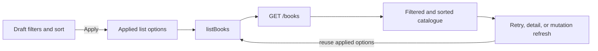

# Books Catalogue Sorting

## Goal

Add sorting to the existing `GET /books` flow across the backend and frontend. Authenticated catalogue users should be able to sort the current result set by title, author, or publication date in ascending or descending order while retaining the existing search and date-filter behavior.

Success means the API validates sort input, applies deterministic ordering server-side, and exposes the contract in OpenAPI. The frontend sends sorting together with the active filters, gives users an accessible sort control, and preserves sorting across retries, detail navigation, and admin mutations.

This plan assumes the product wants `title`, `author`, and publication `date` as the initial sort fields, with ascending and descending directions. Availability, ISBN, copy count, pagination, and client-side-only sorting remain out of scope unless product requirements specify otherwise.

## Current State

- `backend/app/routers/books.py:list_books` already accepts `q`, `date_from`, and `date_to` through `BookListQuery`, and currently orders unsearched results by `Book.id` ascending.
- When `q` is present, the backend currently orders by descending PostgreSQL text-search rank followed by `Book.id`; this relevance behavior should remain the default when no explicit sort is supplied.
- `backend/app/schemas/book.py:BookListQuery` is the existing validation boundary for list query parameters and converts date bounds to epoch seconds.
- `frontend/src/api/books.ts:listBooks` already accepts `BookListFilters` and builds a safe `URLSearchParams` query string for the existing search/date filters.
- `frontend/src/App.tsx` keeps draft and applied filters separately, passes applied filters through list refreshes, and renders the catalogue list for both roles. Sorting should follow the same applied-state pattern.
- Existing backend tests use a `FakeSession` that interprets the generated SQL for search/date filtering. Existing frontend API and App tests mock `listBooks` and cover filter application/clearing.
- The current `books.date` B-tree index was added for date filtering. There are no title/author sort indexes. No schema migration is required for the initial implementation; index additions should be driven by query-plan evidence after the contract is in place.
- Existing frontend search documentation explicitly excludes sorting, so the README and the search technical-design handoff need a small scope update or cross-reference after implementation.

## Decisions

- Add optional `sort_by` and `sort_order` query parameters to `GET /books`:
  - `sort_by`: `title | author | date`, omitted by default.
  - `sort_order`: `asc | desc`, omitted by default and meaningful only with `sort_by`.
- Treat `sort_by` and `sort_order` as a validated allowlist, not raw SQL identifiers. Invalid values return `422`; never interpolate request values into an `ORDER BY` clause.
- Preserve existing default ordering: `Book.id ASC` when no search or explicit sort is supplied; relevance descending then `Book.id ASC` when `q` is supplied without `sort_by`.
- If an explicit sort is supplied with `q`, explicit sorting takes precedence over relevance. This makes the UI predictable and allows users to sort a filtered/search result intentionally.
- Use case-insensitive ordering for `title` and `author` with `lower(...)`, then `Book.id ASC` as the final tie-breaker. Use numeric `Book.date` ordering for publication date, then `Book.id ASC`.
- Require `sort_order` only when `sort_by` is present. If `sort_order` is supplied without `sort_by`, return `422` rather than silently accepting an ineffective parameter.
- Keep search and date predicates unchanged and combine them with sorting in one server-side query. The frontend must not reorder API results locally.
- Add one frontend sort selector with options `Relevance/default`, `Title A-Z`, `Title Z-A`, `Author A-Z`, `Author Z-A`, `Publication date oldest`, and `Publication date newest`. The default option sends neither sort parameter and therefore preserves backend defaults.
- Keep draft sort selection separate from applied sort selection. Applying sorting should reload results explicitly, and clearing filters should clear sorting too and request the unmodified `/books` list.
- Preserve applied sorting for retry, detail return, and successful create/update/delete refreshes. Sign-out clears sorting with the rest of the catalogue state.
- Do not add pagination, URL persistence, debouncing, client-side sorting, new search syntax, or sort options for fields not included in this contract.

## Diagram

## Implementation Steps

1. Extend `BookListQuery` with optional validated `sort_by` and `sort_order` values. Normalize enum values consistently, reject unknown values, and add a model-level validation error when `sort_order` is present without `sort_by`.
2. Refactor `list_books` ordering into a small allowlisted mapping from the validated sort field/direction to SQLAlchemy expressions. Apply `lower(Book.title)` or `lower(Book.author)` for text sorts, `Book.date` for date sorts, and `Book.id.asc()` as the deterministic final key. Preserve the existing relevance ordering only when `q` is present and `sort_by` is absent.
3. Extend backend request tests for every supported field and direction, mixed-case title/author values, equal sort keys, explicit sort with `q`, default no-parameter ordering, invalid values, and `sort_order` without `sort_by`. Update `FakeSession` only enough to model the generated ordering; keep SQL behavior owned by SQLAlchemy/PostgreSQL rather than duplicating the database engine in the fake.
4. Add PostgreSQL-backed coverage, where available, that verifies the returned order for title, author, and date and confirms equal keys fall back to ascending ID. Inspect `EXPLAIN` for larger fixtures if performance becomes a concern; do not add indexes solely because a sort option exists.
5. Regenerate `docs/openapi.json` from the backend application and update `backend/README.md` plus `backend/sample_requests/books.txt` with valid sort examples and the default/relevance semantics.
6. Extend `BookListFilters` in `frontend/src/api/books.ts` with `sort_by` and `sort_order` types. Append only present, applied values with `URLSearchParams`; preserve the exact `/books` request when all list options are empty.
7. Add frontend API tests for each sort combination, combined search/date/sort query encoding, omission of draft/blank values, and no-sort backward compatibility. Keep bearer-header and malformed-response tests intact.
8. Add draft and applied sort state in `App.tsx`, map the UI options to the backend contract, apply the selected sort with the current filters, and clear both filters and sorting from the clear action. Ensure `refreshBooks`, retry, and all mutation refresh paths receive the applied options.
9. Render an accessible labelled sort control in the existing catalogue filter panel for both roles. Show the current applied criteria without exposing raw query syntax, retain the existing loading/empty/error states, and disable the control consistently while a list request is pending.
10. Extend `App.test.tsx` for default ordering, each sort option, sorting combined with filters, clear/reset behavior, retry and mutation refresh preservation, and unchanged admin/user capabilities. Add a stale-request assertion if the new apply path changes the existing request identity handling.
11. Update `docs/tech-design/2026-09-10-frontend-books-search-td.md` and the root `README.md` so the existing search/filter documentation no longer says sorting is excluded and describes explicit apply behavior and supported sort choices.

## Files and Interfaces

- `backend/app/schemas/book.py`: validated `sort_by`/`sort_order` list-query fields and cross-field validation.
- `backend/app/routers/books.py`: safe sort-expression mapping, precedence over relevance when explicitly requested, and deterministic tie-breakers.
- `backend/tests/test_books.py`: request-level sorting, validation, precedence, and tie-breaker coverage.
- `backend/tests/test_database.py`: PostgreSQL result-order coverage and optional query-plan diagnostics if the test suite supports the existing database fixture.
- `backend/README.md`: backend query-parameter documentation and examples.
- `backend/sample_requests/books.txt`: sorted request examples.
- `docs/openapi.json`: regenerated `GET /books` query-parameter contract.
- `frontend/src/api/books.ts`: sort types and query construction.
- `frontend/src/api/books.test.ts`: encoded sort request and regression tests.
- `frontend/src/App.tsx`: draft/applied sort state, sort selector, reset behavior, and sort-aware refresh calls.
- `frontend/src/App.test.tsx`: sort UI, combined options, refresh preservation, and regression tests.
- `docs/tech-design/2026-09-10-frontend-books-search-td.md`: remove the sorting exclusion and align the search/filter handoff.
- `README.md`: document catalogue sorting for users/developers.

## Validation

- From `backend/`, run `./scripts/test.sh` and verify the generated OpenAPI diff includes the four new optional query parameters.
- From `frontend/`, run `npm run lint`, `npm run test`, and `npm run build`.
- Verify `/books` returns ID order with no options, relevance order for an un-sorted text search, and the requested explicit order for each supported field/direction.
- Verify title/author sorting is case-insensitive, ties use ascending ID, and explicit sorting overrides relevance while search/date predicates still constrain the result set.
- Verify invalid `sort_by`, invalid `sort_order`, and `sort_order` without `sort_by` return `422` without executing a query.
- Verify the frontend sends no sort parameters for the default option and safely encodes combined search, date, and sort options while preserving the bearer token.
- Verify applying, clearing, retrying, and mutating books retains or resets sorting exactly as specified; verify sign-out clears it.
- Manually test keyboard access, visible focus, loading announcements, filtered/sorted empty states, and narrow mobile layout for both roles.

## Risks and Open Questions

- The sort fields and default behavior are an assumption because no product sort contract was found. Confirm whether ISBN, availability, copy count, or a different default is required before implementation.
- Case-insensitive title/author sorting uses runtime `lower(...)` expressions. If the catalogue becomes large, inspect query plans and add matching functional B-tree indexes in a separate migration; do not add divergent indexes.
- Publication date is stored as UTC epoch seconds. The UI should label date sorting as publication date and must not introduce a new timezone or display-format policy.
- Existing search documentation was authored as a separate slice and currently says sorting is out of scope. Update it only to reflect this approved sorting slice; do not change unrelated search semantics.
- The fake backend session may not faithfully model descending/case-insensitive SQL ordering. PostgreSQL-backed tests are the authority for actual database behavior.

## Handoff Notes

- Implement the backend contract before wiring the frontend selector, then regenerate OpenAPI before frontend integration tests are finalized.
- Keep the existing search/date query names and semantics unchanged.
- Do not create a migration unless query-plan evidence demonstrates a need for title/author sort indexes; the current `date` index already supports date filtering, not necessarily ordering.
- Preserve unrelated worktree changes and do not modify loan, reservation, notification, or authentication behavior.
