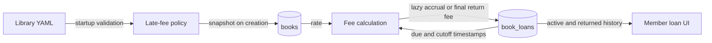

# Persisted Late Fees

## Goal

Add late-fee accrual to the existing book-loan workflow. The server loads one shared daily rate from a YAML policy file, snapshots that rate onto each book when the book is created, persists the accrued fee on each loan, and exposes active and returned fee-bearing loans to their owning user.

Success means fees use complete elapsed 24-hour periods after `due_at_timestamp`, active fees are refreshed and persisted when loan history is accessed, return atomically freezes the final fee, and the frontend shows incurred fees for overdue active loans and returned loan history. Payment collection, payment history, and account-balance calculations remain out of scope.

## Current State

- `Book` stores title-level aggregate inventory and `loan_duration_days`, but no fee policy. API creation copies request fields directly into the model, while the Open Library seed loader creates `Book` rows separately.
- `BookLoan` stores checkout, due, and return timestamps plus `BORROWED`/`RETURNED` status. There is no fee amount or separate overdue status.
- Checkout locks the book, computes `due_at_timestamp` as `loan_timestamp + loan_duration_days * 86_400`, creates the loan, and decrements availability in one transaction.
- An overdue loan remains `BORROWED`. The frontend currently derives overdue state from `due_at_timestamp < current time`.
- `GET /loans/me` returns only active loans. Returned loans remain in the database but disappear from the member UI.
- Return follows a book-before-loan lock order, changes the loan to `RETURNED`, records `returned_timestamp`, and restores availability in one transaction.
- The frontend keeps all catalogue and circulation views in `App.tsx`. Loan titles are resolved from the currently loaded catalogue rather than embedded in loan responses.
- Application settings currently come from environment variables. There is no YAML policy loader or YAML dependency.
- The worktree contains unrelated changes and untracked files. Preserve them and do not modify them as part of this feature.

## Decisions

- Add a committed policy file at `backend/config/library.yaml` with this shape:

  ```yaml
  late_fees:
    daily_rate_cents: 50
  ```

- Add PyYAML as a backend dependency. Load the file with `yaml.safe_load` through a small Pydantic model configured with `extra="forbid"`, using a path anchored to the backend source tree rather than the process working directory.
- Load and validate the policy during backend module initialization, which is part of server startup and is also available to Alembic and the seed loader. A missing file, malformed YAML, unknown shape, non-integer rate, or non-positive rate is a startup/configuration error; do not silently fall back to a hard-coded value.
- Represent money as integer USD cents. Do not use Python or database floating-point values. `daily_rate_cents` must be a positive integer and `late_fee_cents` must be non-negative.
- Add `books.late_fee_cents_per_day INTEGER NOT NULL` with a positive check constraint. Existing books are backfilled from the YAML value in effect when the migration runs.
- The book rate is a creation-time policy snapshot. Set it server-side for API-created and seed-created books, expose it as a read-only `BookResponse` field, and omit it from `BookCreate` and `BookUpdate`. It is immutable through application APIs. A later YAML edit affects only books created afterward.
- Add `book_loans.late_fee_cents INTEGER NOT NULL` with a default application value of zero and a non-negative check constraint. Do not add a fee index because no planned query filters or sorts by fee.
- Existing loan rows are backfilled during migration. Use `returned_timestamp` as the cutoff for returned loans and one migration-wide current epoch timestamp for active loans, joined to each loan's backfilled book rate.
- Do not copy the rate onto `book_loans`: the book rate is immutable through the API, loan history prevents the referenced book from being deleted, and the existing foreign key therefore preserves the applicable rate without another snapshot column.
- A loan is overdue immediately when `cutoff_timestamp > due_at_timestamp`, but it incurs no fee until one complete 24-hour period has elapsed. Calculate:

  ```text
  cutoff_timestamp = returned_timestamp or captured_server_timestamp
  late_periods = max(0, (cutoff_timestamp - due_at_timestamp) // 86_400)
  late_fee_cents = late_periods * book.late_fee_cents_per_day
  ```

- At exactly `due_at_timestamp + 86_400`, one daily fee is due. Partial periods are discarded; there are no calendar-date, timezone, grace-period, or fee-cap rules.
- Keep fee calculation in one backend helper used by migration-equivalent tests, member history accrual, and return. The helper receives timestamps and a rate; it does not read the clock itself. Request handlers capture server time once and pass it in so every loan in one request uses the same cutoff.
- Rename the semantics of `GET /loans/me` from active loans to member loan history. Return both `BORROWED` and `RETURNED` loans owned by the caller, ordered by `loan_timestamp` descending. Keep the route and authorization unchanged.
- `GET /loans/me` performs lazy active-fee accrual. For active loans, preserve the established book-before-loan lock order, revalidate ownership and status after locking, calculate the current fee, update only changed amounts, and commit once before returning the complete history. This accepted design gives the GET request a database write side effect and means persisted active fees are current as of their most recent access rather than continuously current.
- Process active loans in stable `(book_id, loan_id)` order when acquiring locks. This avoids introducing a conflicting lock order when history contains multiple active books and remains compatible with checkout and return.
- Return recalculates the fee with the captured return timestamp after locking and revalidating the book and loan. Persist `late_fee_cents`, `returned_timestamp`, `RETURNED` status, and restored availability in the same transaction. Repeated returns remain `409` and cannot change the frozen fee.
- Add `late_fee_cents` to `BookLoanResponse`. Do not add a new overdue status, overdue-day field, fee resource, balance field, or payment endpoint.
- Update the frontend `BookLoan` runtime guard and type to require `late_fee_cents`. Update `Book` to accept the read-only daily rate, but do not add it to create/edit form values or request payloads.
- Change “My loans” into a history view with separate active and returned sections. Active overdue cards show `Late fee: $0.00` until the first complete late period and the persisted amount thereafter. Returned cards show the frozen fee and return timestamp. Returned loans with zero fees remain history entries.
- Treat server-returned `late_fee_cents` as authoritative. The browser must not calculate money from its own clock. The existing Refresh action is how a user requests a newer active fee; no timer or background polling is added.
- Format cents as USD in one frontend helper. UI copy uses “incurred late fee,” not “outstanding balance,” because payments and balance settlement are out of scope.

## Diagram



## Implementation Steps

1. Add PyYAML to `backend/pyproject.toml` and update `backend/uv.lock`. Add the committed YAML policy file and a focused policy loader/model that resolves the file path relative to the backend source tree and fails clearly on missing or invalid configuration.
2. Extend the SQLAlchemy models with `Book.late_fee_cents_per_day` and `BookLoan.late_fee_cents`, including named positive/non-negative check constraints and application defaults where appropriate.
3. Add reversible Alembic revision `20260911_0007` after current head `20260910_0006`. Read and validate the configured rate before schema mutation; add the two columns, backfill books with the configured rate, calculate historical/final loan fees from timestamps and book rates, apply named constraints and `NOT NULL`, and remove temporary server defaults so all future values come from application logic. Downgrade drops the fee constraints and columns only.
4. Extend book creation so API-created books receive the startup policy rate without accepting it from clients. Extend the seed load path so `Book` rows receive the policy rate at database insertion time; keep fetched/cache CSV content policy-neutral so loading the same catalogue under a later configured policy snapshots the then-current rate.
5. Add a pure integer fee-calculation helper with explicit cutoff, due timestamp, and daily-rate inputs. Cover exact due time, one second late, one second before the first full period, exact 24/48-hour boundaries, returned cutoffs, and large valid values.
6. Extend `BookResponse` with the stored read-only rate and `BookLoanResponse` with the persisted fee. Keep book create/update request schemas unchanged.
7. Change `GET /loans/me` to load the caller's complete loan history and lazily accrue active loans. Acquire book and loan locks in stable book-before-loan order, revalidate each row, write only changed fees, commit once when needed, and return active and returned rows newest first.
8. Extend return handling to capture one return timestamp, calculate and persist the final fee before marking the loan returned, and commit it with the existing inventory restoration. Preserve ownership, status, error, and lock-order behavior.
9. Update frontend API types and runtime validation for the new book and loan response fields. Add a USD cents formatter without introducing a money library.
10. Update the member loan view to present active and returned sections, overdue state, persisted fee, returned timestamp, loading/error/empty states, and the existing return action. Refresh history after borrow and return so a returned loan moves into history rather than disappearing.
11. Regenerate `docs/openapi.json`; update root/backend READMEs, sample requests, and loan terminology to describe history, lazy accrual, the full-period calculation, YAML configuration, and the no-payments limitation.
12. Update backend, PostgreSQL-backed migration/schema, seed, frontend API, and component tests. Preserve existing checkout/inventory concurrency coverage and add fee-specific return/access races.

## Files and Interfaces

- `backend/config/library.yaml`: committed shared late-fee policy.
- `backend/pyproject.toml`, `backend/uv.lock`: YAML parser dependency.
- `backend/app/config.py` or a focused `backend/app/policy.py`: validated policy model, source-tree-relative YAML loading, and startup policy instance.
- `backend/app/models/book.py`: immutable-through-API `late_fee_cents_per_day` column and constraint.
- `backend/app/models/book_loan.py`: persisted `late_fee_cents` column and constraint.
- `backend/alembic/versions/20260911_0007_add_late_fees.py`: book/loan column creation, existing-row backfill, constraints, and downgrade.
- `backend/app/schemas/book.py`: read-only rate in `BookResponse`; create/update remain unchanged.
- `backend/app/schemas/book_loan.py`: `late_fee_cents` in every loan response.
- `backend/app/routers/books.py`: configured rate assignment during API book creation; checkout continues to create loans at zero fee.
- `backend/app/routers/loans.py`: shared fee calculation usage, lazy history accrual, complete member history, and atomic return finalization.
- `backend/scripts/seed_books.py`, `backend/tests/test_seed_books.py`: configured rate assignment at seed insertion without adding policy to fetched catalogue data.
- `backend/tests/test_books.py`: creation response/rate snapshot and update immutability coverage.
- `backend/tests/test_book_loans.py`: fee boundaries, lazy persistence, history visibility, ownership, return finalization, and concurrency coverage.
- `backend/tests/test_database.py`: new columns, defaults, named constraints, migration backfill, and downgrade/re-upgrade checks.
- `frontend/src/api/books.ts`, `frontend/src/api/books.test.ts`: read-only book rate response validation.
- `frontend/src/api/loans.ts`, `frontend/src/api/loans.test.ts`: persisted fee and member-history response validation.
- `frontend/src/App.tsx`, `frontend/src/App.css`, `frontend/src/App.test.tsx`: active/history presentation and fee formatting.
- `docs/openapi.json`, `README.md`, `backend/README.md`, `backend/sample_requests/books.txt`: public contract and operating documentation.

## Validation

- Run backend tests from `backend/` with `./scripts/test.sh`.
- Repeat backend tests with `TEST_DATABASE_URL` pointing to an isolated migrated PostgreSQL database.
- Run `uv run alembic upgrade head`, verify existing books received the configured rate and existing loans received timestamp-derived fees, then downgrade and re-upgrade a disposable database.
- Start with a missing, malformed, zero, negative, and non-integer YAML rate; confirm startup or migration fails before serving requests or partially applying the revision.
- Create a book through the API and seed loader; confirm both snapshot the current YAML rate. Change YAML, restart, create another book, and confirm the existing book is unchanged while the new book receives the new rate.
- Submit a rate field in `BookCreate` and `BookUpdate`; confirm the current Pydantic extra-field behavior ignores it, the server-selected value wins on creation, and no supported update path mutates the stored rate.
- Borrow a book and verify `late_fee_cents == 0`.
- Test fee boundaries at due time, due plus one second, due plus `86_399`, exact `86_400`, exact `172_800`, and returned equivalents. Only complete periods contribute.
- Access `/loans/me` for an overdue active loan, verify the response amount and committed database value match, access it again within the same period, and verify the amount does not change.
- Return an overdue loan and verify status, return timestamp, final fee, and inventory restoration commit together. Advance time and confirm subsequent history access does not alter the returned fee.
- Exercise concurrent history access and return for the same loan. Confirm there is no deadlock, inventory is restored once, and the returned fee uses `returned_timestamp` rather than a later history-access timestamp.
- Confirm `/loans/me` returns only the authenticated user's active and returned loans in descending checkout order. Confirm admin and unauthenticated role behavior remains `403`/`401`.
- From `frontend/`, run `npm test`, `npm run lint`, and `npm run build`.
- Verify the UI shows an overdue active loan with `$0.00` during its first partial late period, increments only after refresh in later complete periods, moves a returned loan into history, and keeps its finalized fee visible.
- Regenerate OpenAPI with the repository script and confirm the checked-in contract includes both fee fields and the revised `/loans/me` semantics.

## Risks and Open Questions

- Lazy accrual makes `GET /loans/me` state-changing and persisted active fees stale between accesses. This is an accepted KISS tradeoff; do not add a scheduler or polling in this feature.
- The migration's existing-book rate is environment-dependent because it intentionally uses the YAML value present when that environment is migrated. Record the deployed value and validate the policy before any DDL so a missing or invalid file cannot produce a partial migration.
- Adding columns and backfilling loans requires table locks and a scan. The current application is small; if realistic production tables are large, split nullable column creation, batched backfill, constraint validation, and `NOT NULL` enforcement into an operational migration sequence with lock timeouts.
- Application-level immutability does not stop direct SQL from changing a book rate. A database trigger is deliberately excluded for simplicity; operational changes must treat the column as historical policy data.
- The existing browser overdue indicator is not continuously refreshed, and the fee intentionally updates only on explicit/server-triggered access. The server fee remains authoritative.
- Returned loans with fees remain visible indefinitely because payment settlement is out of scope. The UI must not label the sum as an outstanding balance.
- The broader product requirements describe individually tracked copies, staff-managed lending, fee balances, and payments. This feature deliberately follows the implemented title-level, member-self-service model and does not close those larger gaps.

## Handoff Notes

- Preserve integer epoch-second conventions and use `86_400` exactly; do not introduce calendar-day or timezone calculations.
- Preserve the existing `BORROWED = 1` and `RETURNED = 2` status model. Overdue remains derived and is not a third status.
- Preserve book-before-loan lock ordering in every fee-writing path. Revalidate ownership and status after locks are acquired.
- Use one captured timestamp per request or migration backfill. Do not call the clock separately for each calculation.
- Do not accept the configured rate from book API payloads and do not expose an edit control.
- Do not add payment, fee-waiver, balance, cap, grace-period, scheduler, notification, renewal, reservation, or copy-level behavior.
- Do not overwrite unrelated dirty or untracked worktree files.
